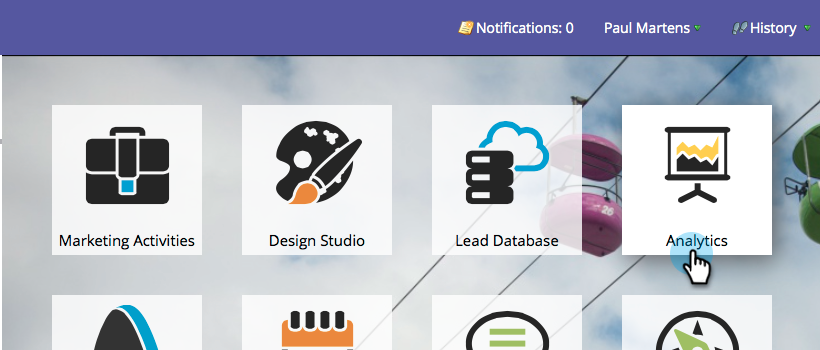
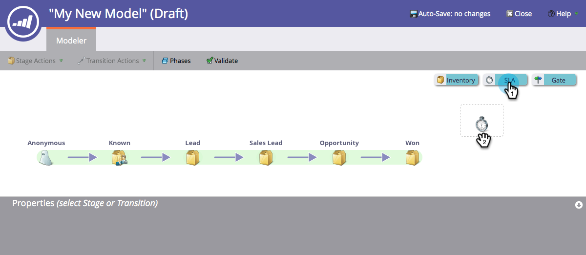
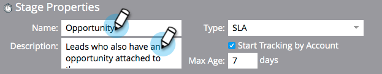
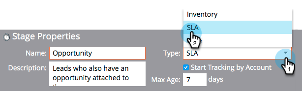
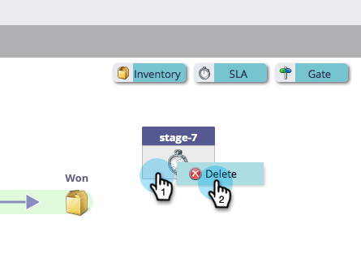
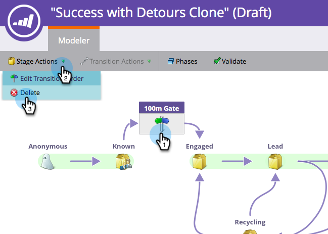

# Using Revenue Model SLA Stages {#using-revenue-model-sla-stages}

SLA stands for “service level agreement.” These stages are used when there is a defined maximum time in which a lead needs to be evaluated or processed before moving forward or out of the process.

>[!TIP]
>
>It's a great idea to create a practice model in a graphics or presentation program and confirm it with your colleagues.

## Add An SLA Stage {#add-an-sla-stage}

1. To add a new Revenue Cycle Model SLA stage, click the **Analytics** button in the My Marketo home screen.

   

1. In the Analytics section, select your existing model, or [create a new one](/help/marketo/product-docs/reporting/revenue-cycle-analytics/revenue-cycle-models/create-a-new-revenue-model.md).

   

1. Click **Edit Draft**.

   

1. To add a new SLA stage, click the **SLA** button, then drag and release to anywhere within the canvas.

   

1. You are free to edit the **Name**, add a **Description** and adjust the **Type** after adding a stage. You may also select **[Start Tracking by Account](/help/marketo/product-docs/reporting/revenue-cycle-analytics/revenue-cycle-models/start-tracking-by-account-in-the-revenue-modeler.md)** at this time.

   

## Edit an SLA Stage {#edit-an-sla-stage}

When you select an SLA stage icon you may edit the Name, add a Description and adjust the Type. You may also select [Start Tracking by Account](/help/marketo/product-docs/reporting/revenue-cycle-analytics/revenue-cycle-models/start-tracking-by-account-in-the-revenue-modeler.md).

1. Click an SLA stage icon.

   

1. Click within the **Name** and **Description** fields to edit their content.

   

1. Select the **Type** pull-down to edit.

   

## Delete An SLA Stage {#delete-an-sla-stage}

1. You may delete an SLA Stage by right-clicking or control-clicking an SLA stage icon.

   

1. You may also delete a stage by clicking it, then in the Stage Actions drop-down, select Delete.

   
