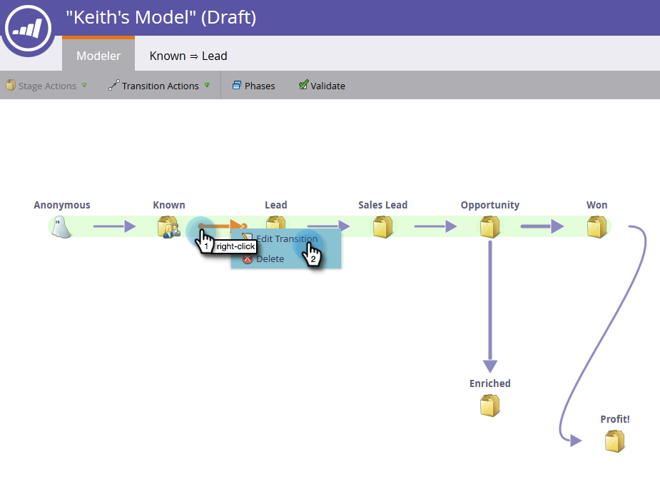
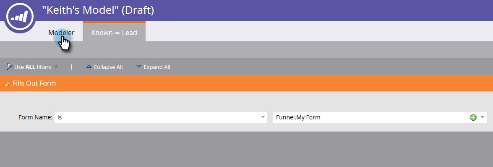

# Using Revenue Model Transitions {#using-revenue-model-transitions}

>[!PREREQUISITES]
>
>[Create a New Revenue Model](/help/marketo/product-docs/reporting/revenue-cycle-analytics/revenue-cycle-models/create-a-new-revenue-model.md)

When you create your model and select and organize your inventory stages, it's time to set the transitions.

1. Right-click (you can also double-click) one of the arrows to get started, and select **Edit Transition**.

   

   >[!NOTE]
   >
   >'Anonymous ⇒ Known' transition rules cannot be edited.

1. A new tab will open for the transition you selected.

   

1. Transitions control how leads move between stages. Drag the trigger (or filter) of your choice from the right, and release anywhere onto the canvas. In this example, we'll select the Fills Out Form trigger.

   >[!TIP]
   >
   >Because the revenue modeler is setting you up for reporting, it's recommended that the transitions always include triggers. That way your reports will reflect the true velocity of your model/stage flow. Filters can be added with the triggers for additional constraints.

   

1. Choose the parameter(s) for your selected trigger/filter.

   

1. To get back to your model, click **Modeler**.

   

1. At the bottom of the screen you will now see the transition rules.

   

1. Once you've configured rules for all your transitions, click **Validate** to verify.

   

1. If done correctly, you will see the following message.

   

Well done! You have successfully modified your model transitions.

>[!MORELIKETHIS]
>
>[Approve/Unapprove a Revenue Model](/help/marketo/product-docs/reporting/revenue-cycle-analytics/revenue-cycle-models/approve-unapprove-a-revenue-model.md)
