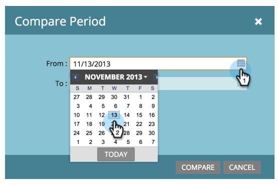
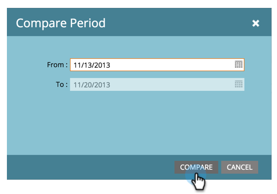
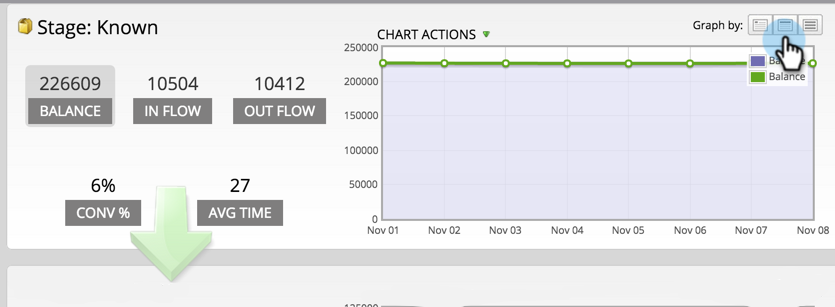
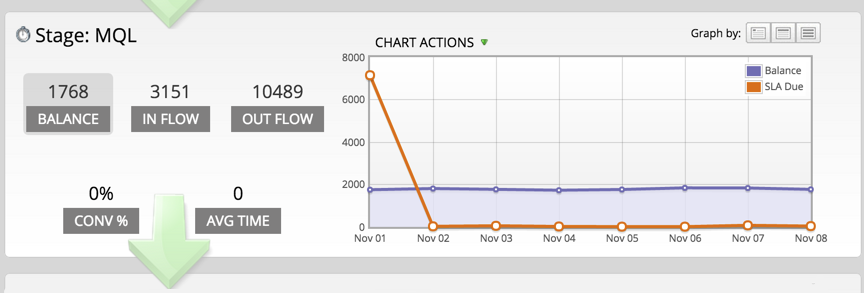
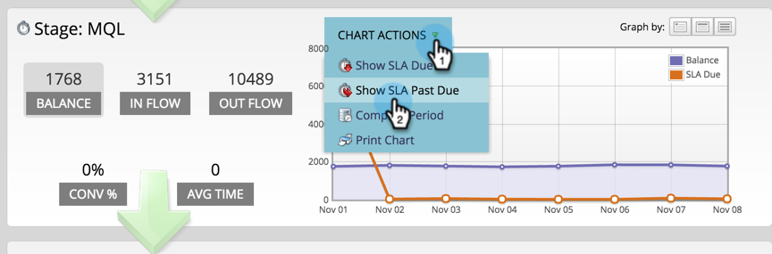
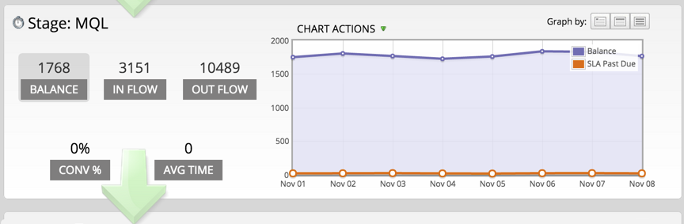
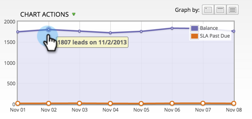
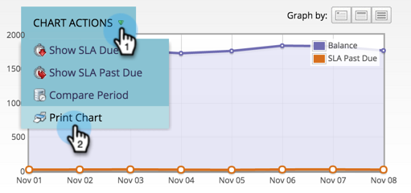

# Using the Success Path Analyzer {#using-the-success-path-analyzer}

Use a Success Path Analyzer to explore the specific details that reflect both flow (amount) and velocity (speed, in terms of days) of people through the stages of your [Revenue Cycle Model](/help/marketo/product-docs/reporting/revenue-cycle-analytics/revenue-cycle-models/understanding-revenue-models.md).

>[!PREREQUISITES]
>
>[Create a Success Path Analyzer](/help/marketo/product-docs/reporting/revenue-cycle-analytics/revenue-cycle-models/create-a-success-path-analyzer.md)

1. Go to **[!UICONTROL Analytics]** and select your **Success Path Analyzer**.

   

   The chart on the right reflects the data in the selected button on the left. By default, this is **[!UICONTROL Balance]**.

1. Click **[!UICONTROL In Flow]** to graph how many people entered the stage during the selected time frame.

   

    * Click **[!UICONTROL Out Flow]** to graph how many people exited the stage. 
    * Click **[!UICONTROL Conv %]** to graph the conversion rate from this to the next stage.
    * Click **[!UICONTROL Avg Time]** to see how long people spent in this stage before moving to the next stage.

1. Click **[!UICONTROL Chart Actions]** > **[!UICONTROL Compare Period]** to compare the data to a different time frame of equal length.

   

1. Select the **[!UICONTROL From]** date for the compare period.

   

   The **[!UICONTROL To]** date is automatically set to match the length of your original time period.

1. Click **[!UICONTROL Compare]**.

   

1. The chart updates with overlapping data for the compare period, in green.

   

1. To change the time scale of the chart, click one of the **[!UICONTROL Graph by]** buttons: daily (default), weekly, and monthly

   

1. For stages with SLAs (Service-Level Agreements), click **[!UICONTROL Chart Actions]** > **[!UICONTROL Show SLA Due]** to show every person that ever missed an SLA target within the specified time frame.

   

1. The chart updates to reflect how many SLAs were due on each node, in orange.

   

   The people shown in orange might *or might not* still be in the SLA stage.

1. Click **[!UICONTROL Chart Actions]** > **[!UICONTROL Show SLA Past Due]** to show all people with expired SLA targets who are still in the SLA stage at the end of the specified time period.

   

1. The chart updates to reflect how many SLAs were overdue on each node, in orange.

   

1. To read the specific details of a data point on a specific node (date), hover over the bubble.

   

1. To print the chart, click **[!UICONTROL Chart Actions]** > **[!UICONTROL Print Chart]**.

   

The analyzer is here to help you understand movement through your model. As you get more advanced, this will become really important to strategize your marketing efforts.
