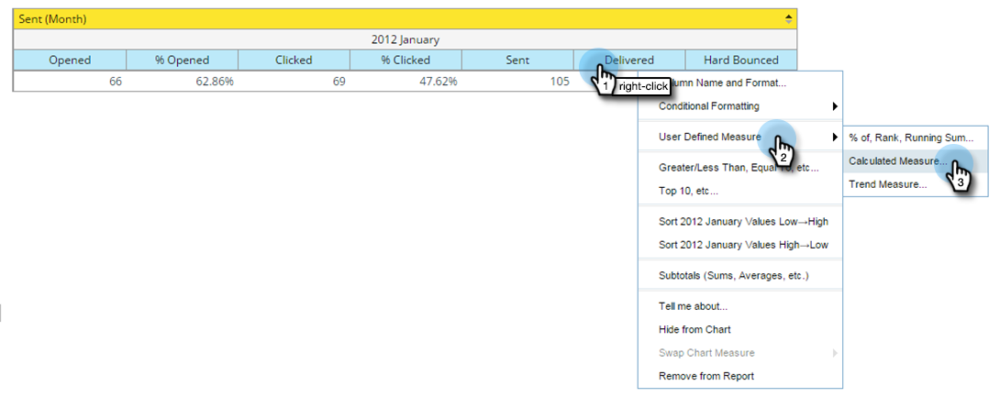

# Adding Custom Measures to a Revenue Explorer Report {#adding-custom-measures-to-a-revenue-explorer-report}

Sometimes, you want a custom measure in a report. It's easy to create your own.

In the example below, you are creating a calculated measure for soft bounces, which takes metrics already in the report and uses basic math to create a new metric. You can create other types of measures, too.

>[!PREREQUISITES]
>
>You need at least one metric in your report, but it doesn't have to be one of the measures you use to define your custom measure.

1. Pull over the fields you need for your report. See [Adding Fields to a Revenue Explorer Report](/help/marketo/product-docs/reporting/revenue-cycle-analytics/revenue-explorer/adding-fields-to-a-revenue-explorer-report.md) for details.

1. Right-click an existing metric (blue cell), click **User Defined Measure** and select **Calculated Measure**.

   

1. Name your custom measure and select a format.

   

1. Click each item you need on the left and click the arrow to move it over. Add math symbols as needed.

   

   >[!TIP]
   >
   >You can type the math symbols yourself or use the selection box.

1. When you're done, click **OK**.

   

   Your new custom measure appears as a new column in the report.

   

   >[!MORELIKETHIS]
   >
   >[Adding Fields to a Revenue Explorer Report](/help/marketo/product-docs/reporting/revenue-cycle-analytics/revenue-explorer/adding-fields-to-a-revenue-explorer-report.md)
