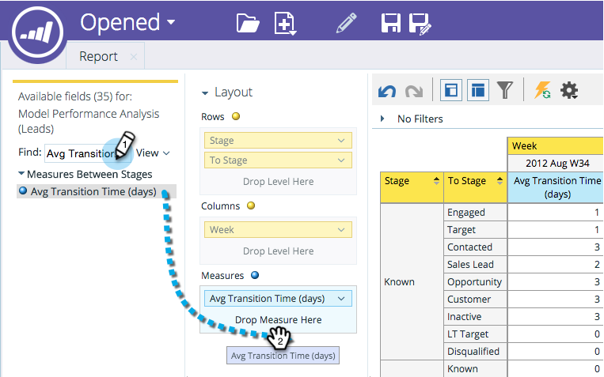
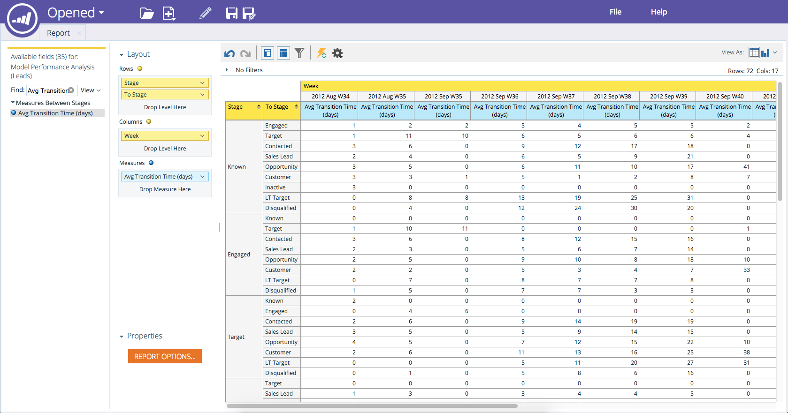

# Adding Fields to a Revenue Explorer Report {#adding-fields-to-a-revenue-explorer-report}

Customize revenue explorer reports by dragging and dropping dimension and metric fields into the canvas. 

<table> 
 <tbody> 
  <tr> 
   <th>Field Type</th> 
   <th>Description</th> 
  </tr> 
  <tr> 
   <td>Yellow Field or Dimension</td> 
   <td>
Yellow fields are the dimensions (rows and columns) of your report.

For example, you can set up a report which shows your lead status or creation date in columns.
</td> 
  </tr> 
  <tr> 
   <td>Blue Field or Measure</td> 
   <td>
Blue fields are metrics that are analyzed in your data.

For example, this could be the average lead score for your leads, or the number of days a lead had an opportunity.
</td> 
  </tr> 
 </tbody> 
</table>

1. Find the yellow field(s) you want to use and drag it into Rows.

   

   >[!TIP]
   >
   >Hover over a field for a full description.

1. Find the blue field(s) you want to use and drag it into Measures.

   

   Awesome! Now you've got a full-fledged report!

   

>[!NOTE]
>
>**Related Articles**
>
>* [Deleting a Field in a Revenue Explorer Report](deleting-a-field-in-a-revenue-explorer-report.md)
>

