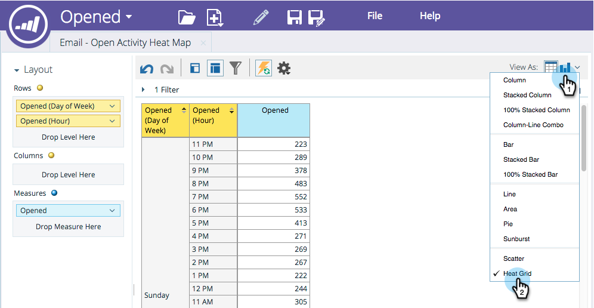

# Customize and Display Heat Grids {#customize-and-display-heat-grids}

A heat grid visually represents your data in a colored grid so that you can identify good and bad patterns more easily and quickly.

1. In your report, click the chart icon and then **[!UICONTROL Heat Grid]**.

   

1. To make changes to your **[!UICONTROL Heat Grid]**, go to the **[!UICONTROL Properties]** area.

   

   Awesome! You now have your **[!UICONTROL Heat Grid]**!
