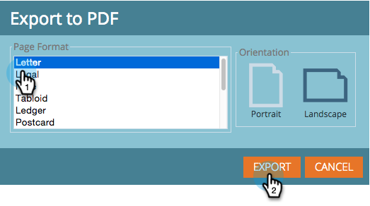

# Exporting a [!UICONTROL Revenue Explorer] Report {#exporting-a-revenue-explorer-report}

You can export any revenue explorer report and share it with anyone.

1. Click the Gear icon, select **[!UICONTROL Export]** and select a file format.

   

   >[!NOTE]
   >
   >You can export a report to the following three formats:
   >
   >* PDF
   >* [!DNL Excel]
   >* CSV

1. Select the desired **[!UICONTROL Page Format]** and **[!UICONTROL Orientation]**, and click **[!UICONTROL Export]**.

   

   Sweet! Send this file around and impress your peers with your ninja-like marketing skills.

>[!MORELIKETHIS]
>
>[Subscribe to a [!UICONTROL Revenue Explorer] Report](/help/marketo/product-docs/reporting/revenue-cycle-analytics/revenue-explorer/subscribe-to-a-revenue-explorer-report.md)
