# Graphing Results From [!UICONTROL Revenue Explorer] {#graphing-results-from-revenue-explorer}

By default, reports in [!UICONTROL Revenue Explorer] display as a table. You also have the option of displaying results as a graph in various formats.

1. Click the arrow in the **[!UICONTROL View As]** drop-down menu of your report. Different graphing options will appear.

   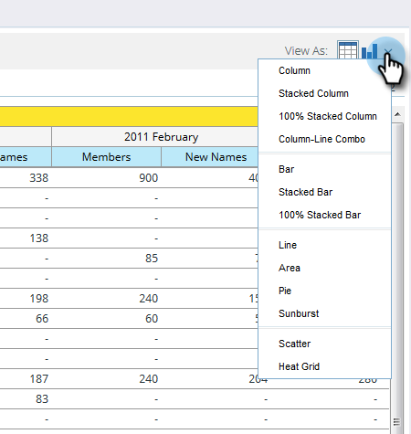

## Graph Examples {#graph-examples}

   **[!UICONTROL Column]**: Each row and column in the table is displayed as a vertical column.

   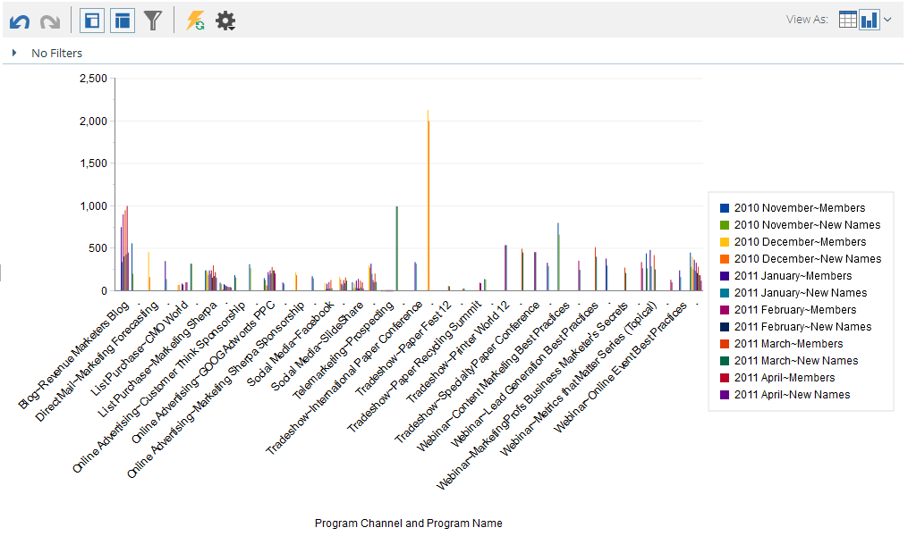

   **[!UICONTROL Stacked Column]**: Each row in the table has one column in the graph.

   

   **[!UICONTROL 100% Stacked Column]**: Each row in the table has one column in the graph and is scaled to 100%.

   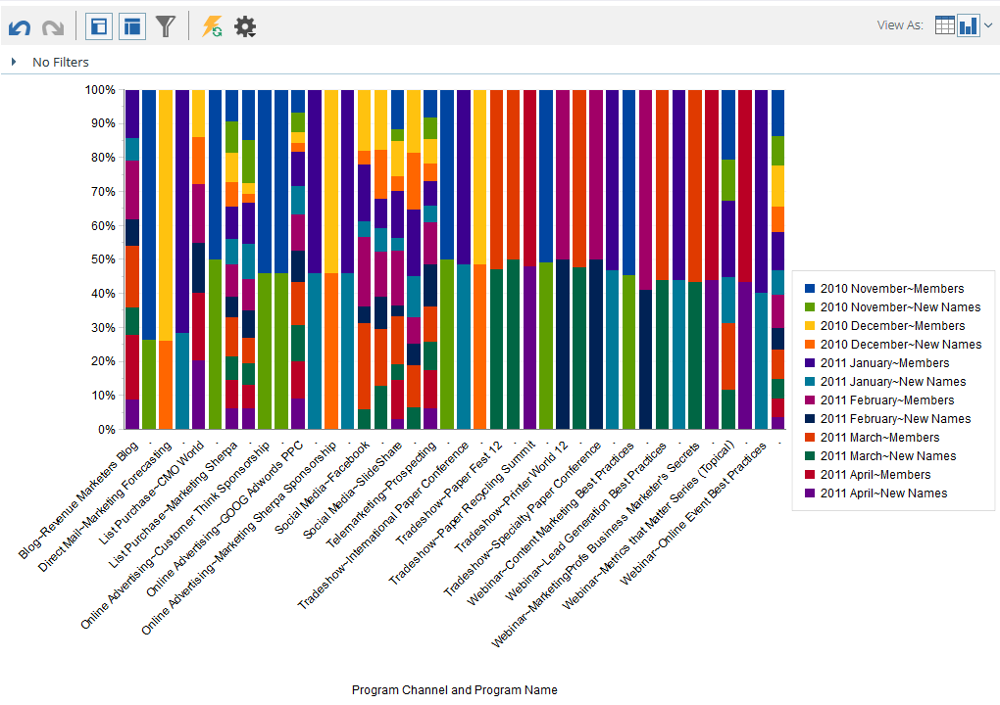

   **[!UICONTROL Line]**: Each column is displayed as a line and each row as a data point on the line.

   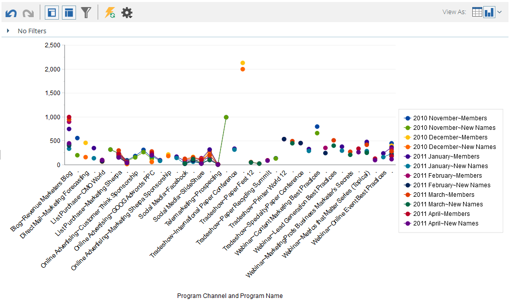

   **[!UICONTROL Column-Line Combo]**: Combination of [!UICONTROL Column] and [!UICONTROL Line] graphs.

   

   **[!UICONTROL Bar]**: Each row and column in the table is displayed as a horizontal bar.

   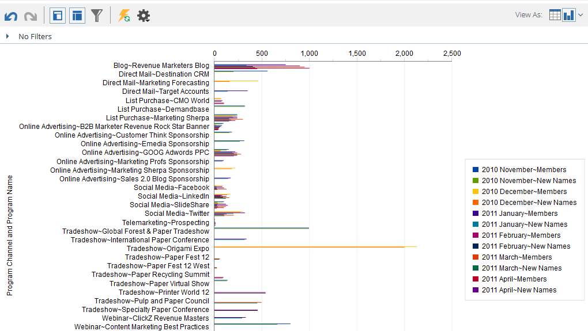

   **[!UICONTROL Stacked Bar]**: Each row in the table has one row in the graph.

   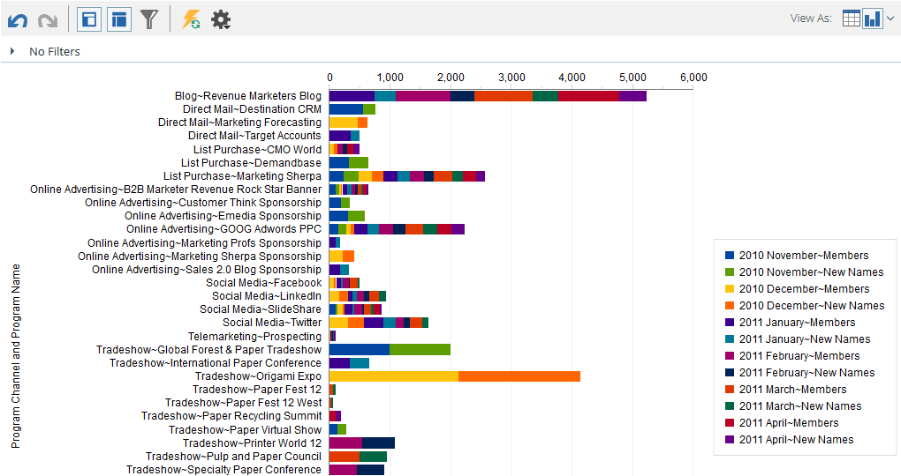

   **[!UICONTROL 100% Stacked Bar]**: Each row in the table has one row in the graph and is scaled to 100%.

   

   **[!UICONTROL Area]**: Data is shown similar to Stacked Bar but filled in.

   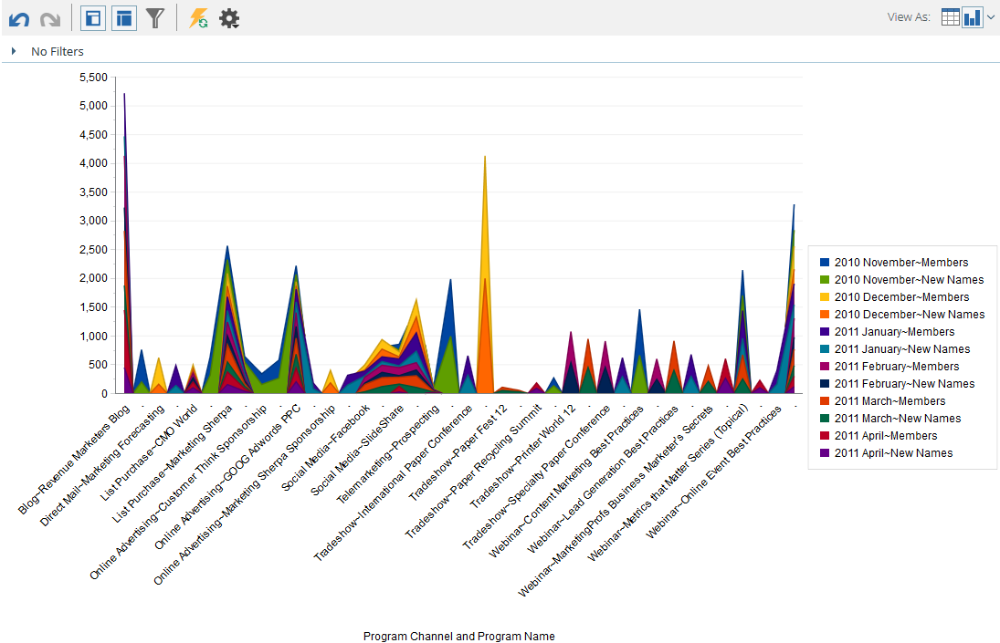

   **[!UICONTROL Pie]**: Each column is shown as a pie chart, each row as a slice.

   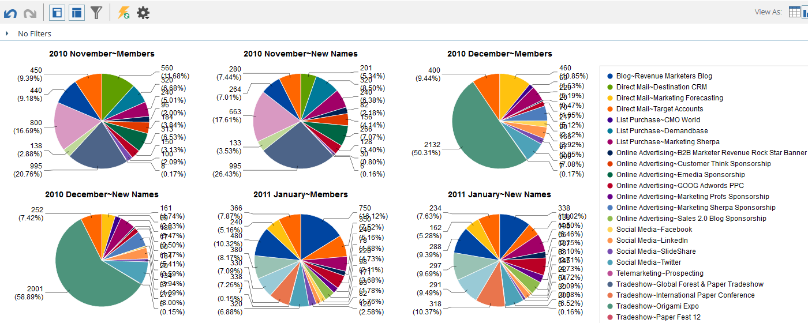

   **[!UICONTROL Sunburst]**: Radial graph that represents attributes in slices.

   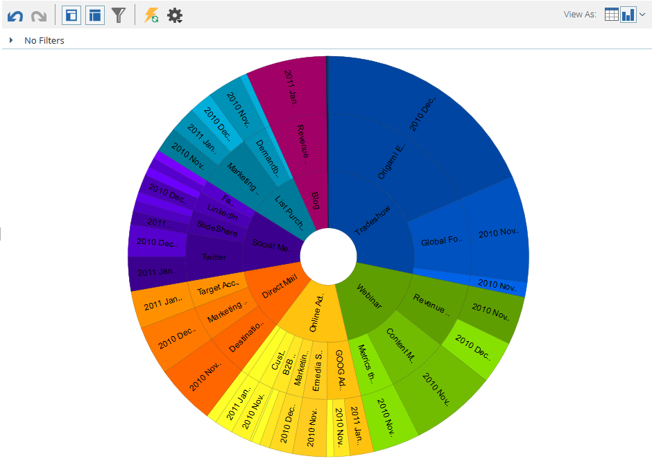

   **[!UICONTROL Scatter]**: Bubbles based on attributes used. Use measures to color-code the bubble and/or determine its size.

   

   **[!UICONTROL Heat Grid]**: Customize colors and shapes to identify positive and negative performance patterns.

   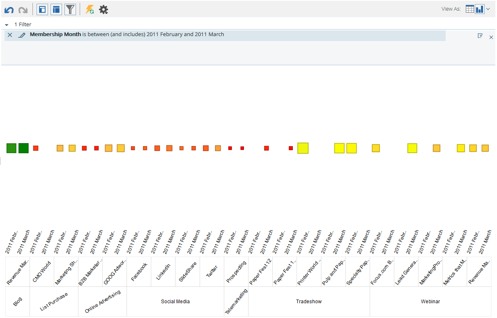

1. To switch back to table view, click the table button.

   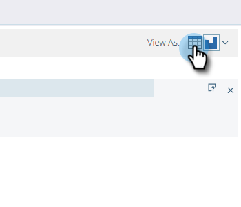
