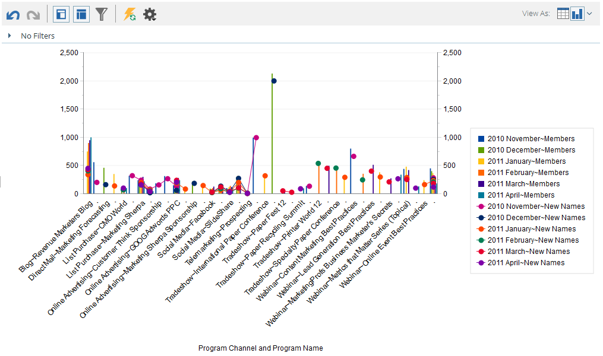

# Graphing Results From Revenue Explorer {#graphing-results-from-revenue-explorer}

By default, reports in Revenue Explorer display as a table. You also have the option of displaying results as a graph in various formats.

1. Click the arrow in the **View As** drop-down menu of your report. Different graphing options will appear.

   

   ## Graph Examples {#graph-examples}

   **Column**: Each row and column in the table is displayed as a vertical column.

   

   **Stacked Column**: Each row in the table has one column in the graph.

   

   **100% Stacked Column**: Each row in the table has one column in the graph and is scaled to 100%.

   

   **Line**: Each column is displayed as a line and each row as a data point on the line.

   

   **Column-Line Combo**: Combination of Column and Line graphs.

   

   **Bar**: Each row and column in the table is displayed as a horizontal bar.

   

   **Stacked Bar**: Each row in the table has one row in the graph.

   

   **100% Stacked Bar**: Each row in the table has one row in the graph and is scaled to 100%.

   

   **Area**: Data is shown similar to Stacked Bar but filled in.

   

   **Pie**: Each column is shown as a pie chart, each row as a slice.

   

   **Sunburst**: Radial graph that represents attributes in slices.

   

   **Scatter**: Bubbles based on attributes used. Use measures to color-code the bubble and/or determine its size.

   

   **Heat Grid**: Customize colors and shapes to identify positive and negative performance patterns.

   

1. To switch back to table view, click the table button.

   

