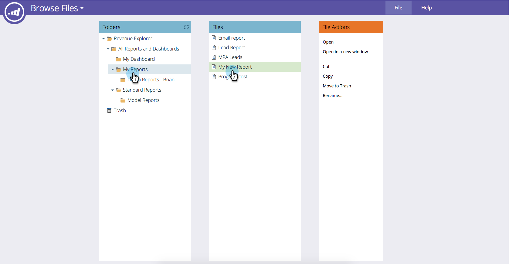

# Saving a Revenue Explorer Report {#saving-a-revenue-explorer-report}

Revenue Explorer reports can be saved to the file of your choice.

1. Click on the **Save **icon.

   

   >[!NOTE]
   >
   >Changes you make to your report are not saved automatically. So make sure to save often!

1. Give your report a descriptive name, select a location, and click **Save**!

   

   That's all! You can now access your file in **Browse Files**.

   

>[!NOTE]
>
>**Related Articles**
>
>* [Subscribe to a Revenue Explorer Report](subscribe-to-a-revenue-explorer-report.md)
>

