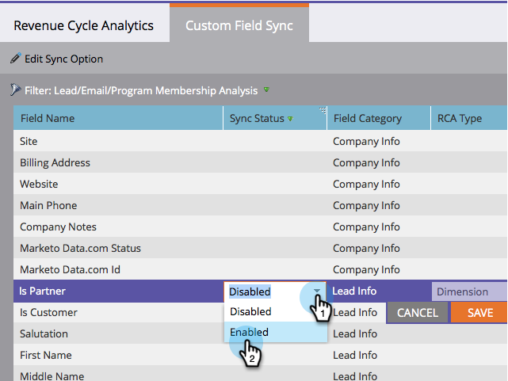

# Sync Custom Fields to the [!UICONTROL Revenue Explorer] {#sync-custom-fields-to-the-revenue-explorer}

[!UICONTROL Revenue Cycle Analytics] can report on custom Marketo fields, in order to do so you need to set the custom fields to be synched.

>[!NOTE]
>
>**Admin Permissions Required**

1. Go to the **[!UICONTROL Admin]** section.

   

1. Select **[!UICONTROL Revenue Cycle Analytics]**.

   

1. Click on the **[!UICONTROL Custom Field Sync]** tab and pick the analysis area of your choice.

   

1. Select the field you want to enable sync for and click on **[!UICONTROL Edit Sync Option]**.

   

1. Change the **[!UICONTROL Sync Status]** to **[!UICONTROL Enabled]**.

   

1. Select the **[!UICONTROL RCA Type]** of your choice, then click **[!UICONTROL Save]**.

   

   >[!TIP]
   >
   >Once enabled, the data will be available in [!UICONTROL Revenue Cycle Analytics] the following day.

   Nice job! Now you know how to add custom fields to RCA.
