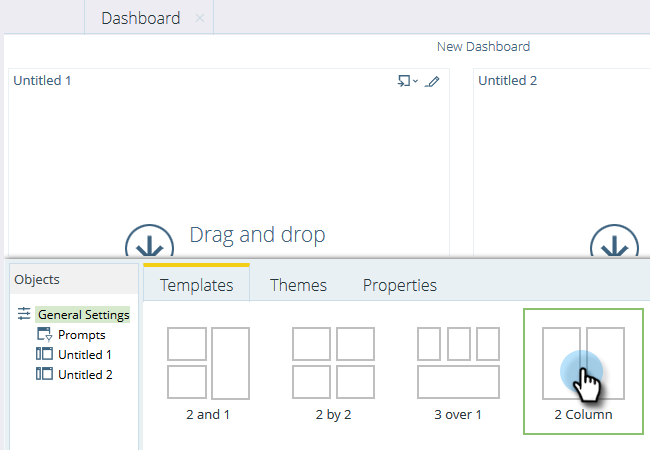
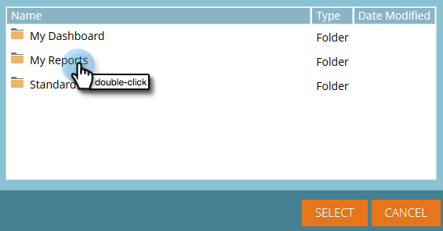
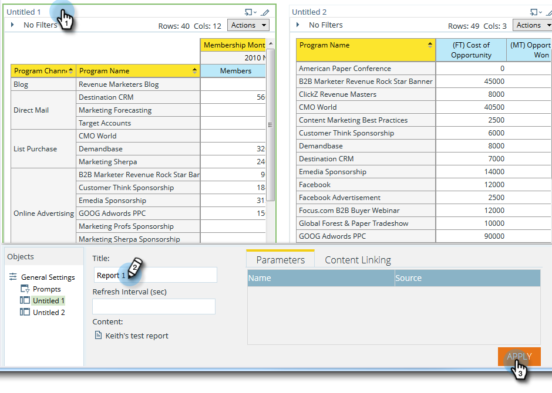
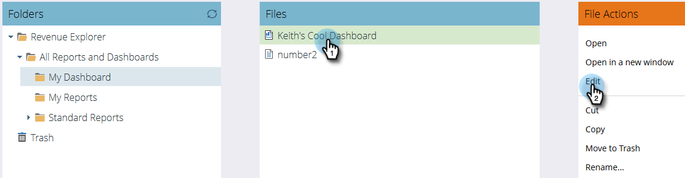
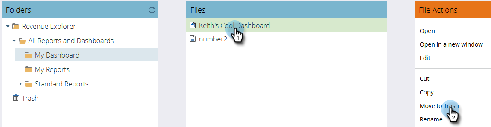

# Using Dashboards in Revenue Explorer {#using-dashboards-in-revenue-explorer}

A dashboard is a combination of Revenue Explorer reports to get a quick overview of your leads, campaigns, opportunities, and/or models.

## Creating a New Dashboard {#creating-a-new-dashboard}

1. Click **Revenue Explorer**.

   

1. Click **Create New**, then **Dashboard**.

   

1. At the bottom of the page, Templates will be selected by default. Click the layout you want to use. "2 Column" is used here.

   

   >[!NOTE]
   >
   >You can further customize your dashboard's appearance by clicking **Themes** and choosing your favorite.

1. In the first section of your dashboard, click the **Insert** icon and select **File**.

   

1. Double-click **Revenue Explorer**.

   

1. Double-click **All Reports and Dashboards**.

   

1. Double-click the folder that houses the report you wish to use.

   

1. Choose your report and click **Select**.

   

1. The report will then populate. Repeat steps 4-8 for each remaining section.

   

1. To rename a section, click on it to select it, type the desired name under Title, and click **Apply**. Repeat for each section.

   

1. To save, click the Save icon, enter a filename, double-click the Revenue Explorer folder until you get to the desired folder for your dashboard, and click **Save**.

   

## Editing a Dashboard {#editing-a-dashboard}

1. Click **Revenue Explorer**.

   

1. Double-click the **Revenue Explorer** folder. Navigate to where your dashboard lives.

   

1. Select the dashboard you wish to edit, then click **Edit**.

   

## Deleting a Dashboard {#deleting-a-dashboard}

1. Click **Revenue Explorer**.

   

1. Double-click the **Revenue Explorer** folder. Navigate to where your dashboard lives.

   

1. Select the dashboard you wish to delete, then click **Move to Trash**.

   
