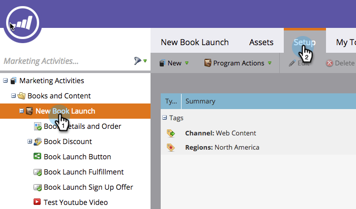
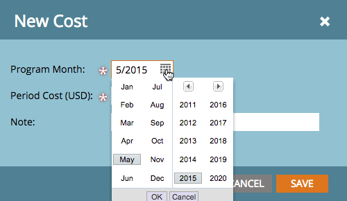
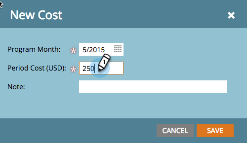
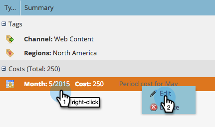
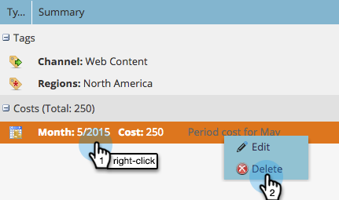
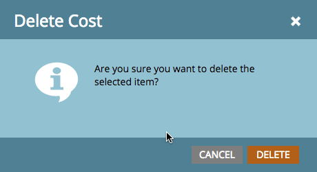

# Define Period Costs {#define-period-costs}

>[!NOTE]
>
>**Definition**
>
>A period cost is the amount you spend on a program. It can be for one or more months and is used for reporting ROI.

Track and associate lead nurturing and lead acquisition costs for a Program or Event by defining when and where you want to take costs for leads. 

>[!NOTE]
>
>At the beginning of a Program, enter forecasted costs. Once the period in the Program completes, you can edit the Period Cost and enter in the actual cost. This will provide you with accurate reporting results.

## Define a Period Cost {#define-a-period-cost}

1. Access the **Setup** tab of your Program or Event.

   

1. Drag and drop **Period Cost** to the canvas and the **New Cost** dialog box displays.

     

1. Enter the **Program Month** you want to associate with the defined cost.

   

1. Enter a **Period Cost** as a whole number without decimals or commas (max limit: 99999999)

   

   >[!NOTE]
   >
   >The currency (e.g. USD, EUR, etc.) is a global setting managed by a Marketo Admin

1. Enter a descriptive **Note** (optional) and click **Save**.

   

## Edit a Period Cost {#edit-a-period-cost}

1. Right-click the Period Cost and select **Edit **from the pop-up menu to open the **Edit Cost** dialog box.

   

1. Edit the period cost as needed

   

## Delete a Period Cost {#delete-a-period-cost}

1. Right-click the Period Cost you wish to delete and select **Delete **from the pop-up menu to display the **Delete Cost **prompt.

   

1. Click **Delete** to permanently delete the Period Cost, or **Cancel** to go back.

   

