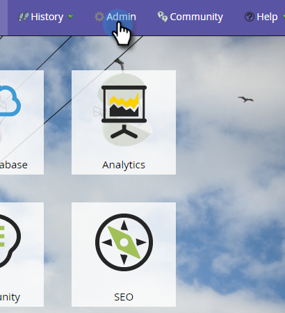
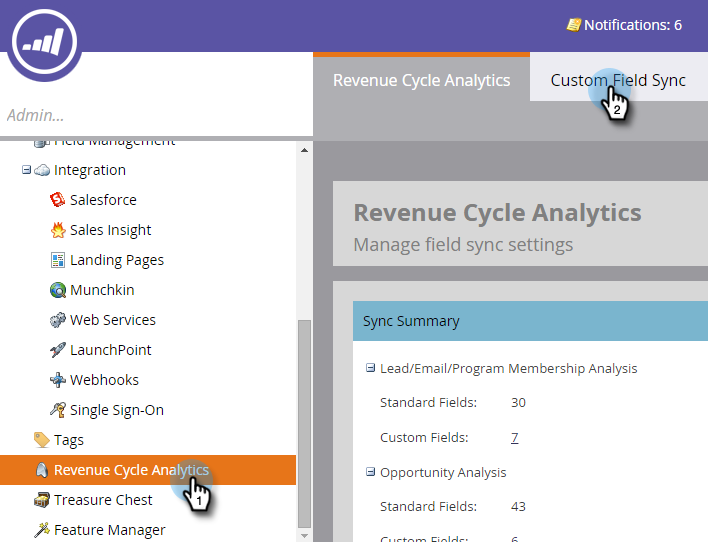
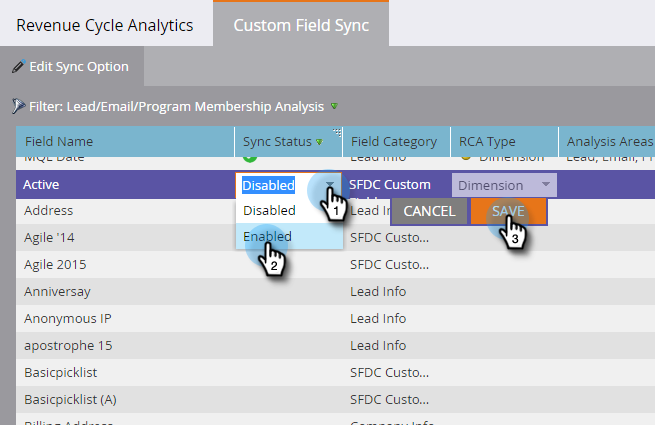
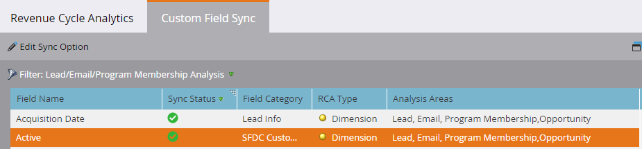

# Enabling Custom Field Sync for Revenue Cycle Analytics {#enabling-custom-field-sync-for-revenue-cycle-analytics}

The following steps will allow you to utilize custom fields in RCA reports.

1. Click **Admin**.

   

1. Click **Revenue Cycle Analytics**, then **Custom Field Sync**.

   

1. Select your **Field Name**, then click **Edit Sync Option**.

   

1. Under Sync Status, select **Enabled**, then click **Save**.

   

1. The green check lets you know that the field is set up to sync.

   

   And that's that!

   >[!NOTE]
   >
   >After the field is enabled, the data will be available in Revenue Cycle Analytics the next day.
