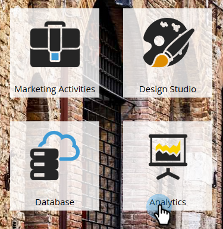
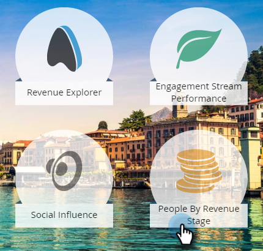
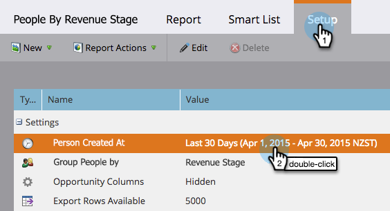

# People by Revenue Stage Report {#people-by-revenue-stage-report}

You can create a report showing which stage of your Revenue Cycle Model your people are in. The report includes any stage from the specified model as long as there is a person balance for the given date range of the report.

>[!AVAILABILITY]
>
>Not all Marketo editions include this functionality. Contact your Account Manager for more detail.

1. Go to **[!UICONTROL Analytics]**.

   

1. Click the report for **[!UICONTROL People by Revenue Stage]**.

   

1. Click the **[!UICONTROL Setup]** tab. Double-click the **[!UICONTROL Person Created At]** field to set the desired time frame to report on.

   

1. Edit the time frame and click **[!UICONTROL Save]**.

   

1. Click the **[!UICONTROL Report]** tab. Now you can see which stage of your revenue model your people are in, and focus on any bottlenecks.

   
