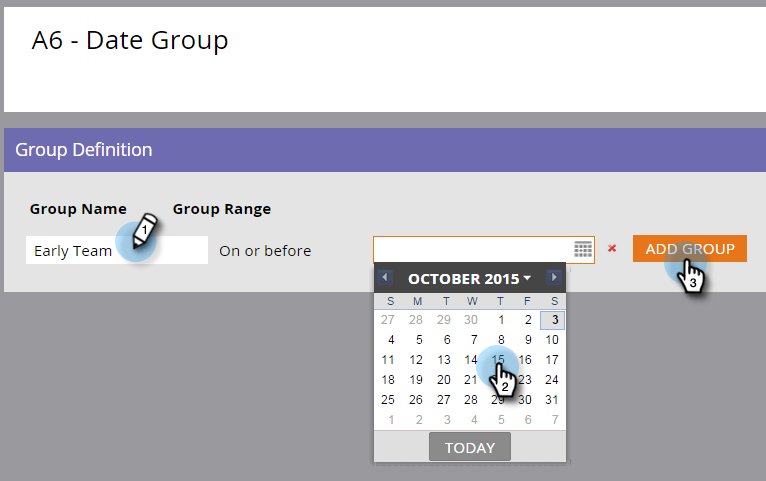

# Using Field Organizers {#using-field-organizers}

Field organizers help you to specify certain fields out of all possible values. For example, you can create meaningful groupings, such as West Coast and East Coast, for the Territory field. This helps reports run more quickly.

Field organizers are similar to segmentations, which are used generically, but field organizers are used for reporting at the field level.

You can have up to three custom segmentations in a field list.

There is no specific Field Organizers report.

Field Organizers are used in Model Performance Analysis.

#### How to Create Field Organizers {#how-to-create-field-organizers}

1. Click **Database**.

   

1. Under **New**, select **New Field Organizer**.

   

1. Under **Field**, select an attribute. Description is optional.

   

1. Click **Create**.

   

1. Name the group and enter the appropriate data (this will depend on the selected field's data type). Click **Add Group**.

   

Create more field organizers the same way, if you need them. And there you are.

>[!NOTE]
>
>**Related Articles**
>
>[Create Custom Field Groups Using the Field Organizer](using-field-organizers/create-custom-field-groups-using-the-field-organizer.md)

