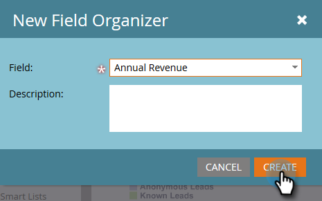

# Create Custom Field Groups Using the Field Organizer {#create-custom-field-groups-using-the-field-organizer}

Before you can enable custom field groups for reporting in the Model Performance Analysis (Leads) Area of Revenue Cycle Explorer, you must categorize standard or custom fields into groups for reporting via the Field Organizer in Marketo Lead Management. This only applies to lead and company attributes.
When you select a standard or custom field from the Field drop-down in the New Field Organizer dialog box, the system maps the Marketo Lead Management data type associated with the field you want to group with one of three available editors in the Field Organizer: string, integer, or date. 

| Marketo Lead Management Data Type |Field Organizer Editor Data Type |
|---|---|
| String |String |
| Email |String |
| Integer |Integer |
| Text |String |
| URL |String |
| Reference |Not Supported |
| Currency |Integer |
| DateTime |Date |
| Boolean |Not Supported |
| Phone |String |
| Date |Date |
| Float |Integer |
| Calculated |Not Supported |

The next three sections describe how to create a custom field group for a string, integer, or date type.

## Create Custom Field Group - String Editor {#create-custom-field-group-string-editor}

1. Click **Lead Database**.

   

1. Click **New**, and select **New Field Organizer**.

   

1. Click **Field** and select a standard or custom field with a data type that maps to the string editor (see table in previous section). Country is used here.

   

1. Click **Create**.

   

   The new custom group displays in the Lead Database tree represented as Field Name > Field Name Group (example: Country > Country Group).

   

1. Click the pencil icon to customize the name. For example, you might rename "Country Group" to "Continent". Type the desired new name and click away from the box to auto-save.

   

1. By default, all data values are placed in the "Other" sub-group. To categorize the data values, click **Add Group** to create a sub-group and give it a name.

   >[!NOTE]
   >
   >You can add up to ten sub-groups to categorize the data values. Each sub-group created is assigned an ID number.

   In this example, groups have been created for most of the continents.

   

   >[!NOTE]
   >
   >To delete a sub-group, simply click the red X next to the sub-group name. If there are any data values in the group, the data values will be moved to the default group of Other.

1. Highlight a data value(s) in the canvas and drag and drop the data value(s) into the appropriate sub-group.

   

   >[!NOTE]
   >
   >To remove a data value from a sub-group, reassign the data value to the default group of Other.

1. Use the filter option in the upper left corner directly above the canvas to select and view the data values in one or more sub-groups. The data values based on your filter selection display in the canvas.

   

   >[!NOTE]
   >
   >After the groups are defined, you can enable the custom field group for reporting in Model Performance Analysis (Leads) via the Revenue Cycle Analytics tab in Marketo Lead Management.

## Create Custom Field Group - Integer Editor {#create-custom-field-group-integer-editor}

1. Click **Lead Database**.

   

1. Click **New**, and select **New Field Organizer**.

   

1. Click **Field** and select a standard or custom field with a data type that maps to the string editor (see table in previous section). Annual Revenue is used here.

   

1. Click **Create**.

   

   The new custom group displays in the Lead Database tree represented as Field Name > Field Name Group (example: Annual Revenue > Annual Revenue Group).

   

1. Click the default custom group name above the integer editor to customize the name. For example, you might rename "Annual Revenue Group" to "Annual Revenue by Size". Click **Save**.

   

   The integer editor allows you create multiple sub-groups to define each sub-group by size. In this example, three groups will be created for Small, Medium, and Enterprise businesses.

1. To add your first group, enter a name in the **Group Name** field (example: Small) and enter a max value in the **Group Range** field (example: 200000). Click **Add Group**.

   

   An empty group entry displays below the group just entered. The example below shows an entry for Small, Medium, and Enterprise businesses.

   >[!NOTE]
   >
   >You can add up to ten sub-groups to categorize the data values. Each Group Range entry builds upon the previous entry. If you leave the last Group Range entry blank for the last custom sub-group you create, a maximum data value is not set.

1. Click the Summary tab to save and review your settings.

   

   >[!NOTE]
   >
   >To delete a sub-group, click the red X next to the sub-group name.

1. On the Summary page, review your settings.

   

   >[!NOTE]
   >
   >After the groups are defined, you can enable the custom field group for reporting in Model Performance Analysis (Leads) via the Revenue Cycle Analytics tab in Marketo Lead Management.

## Create Custom Field Group - Date Editor {#create-custom-field-group-date-editor}

1. Click **Lead Database**.

   

1. Click **New**, and select **New Field Organizer**.

   

1. Click **Field** and select a standard or custom field with a data type that maps to the string editor (see table in previous section). Acquisition Date is used here.

   

1. Click **Create**.

   

   The new custom group displays in the Lead Database tree represented as Field Name > Field Name Group (example: Acquisition Date > Acquisition Date Group).

   

1. Click the default custom group name above the date editor to customize the name. For example, you might rename "Acquisition Date Group" to "Acquisition Date Categories". Click **Save**.

   

   The date editor allows you create multiple sub-groups and define each sub-group by date. In this example, three groups will be created: Q1-15 Leads, Q2-15 Leads, and Q3-15 Leads.

1. To add your first group, enter a name in the **Group Name** field (example: Q1-15 Leads) and enter a date in the date field that represents the date the lead was acquired on or before (example: 3/31/2015 for the last day of Q1-15). Click **Add Group**.

   

   >[!NOTE]
   >
   >You can add up to ten sub-groups to categorize the data values. Each Group Range entry builds upon the previous entry. If you leave the last Group Range entry blank for the last custom sub-group you create, an end date value is not set.

   

   And that's it! Good job.

The example below shows an entry for Q1 2015 leads through Q3. 