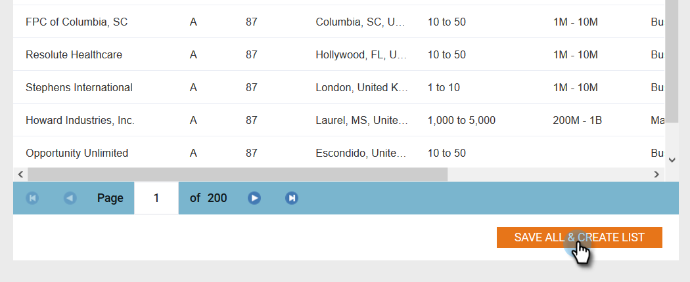
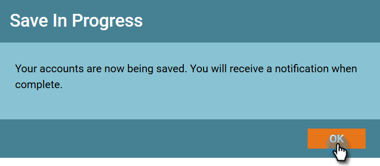

# New Account Discovery {#new-account-discovery}

New Account Discovery can help you find new accounts to target by using AI-powered recommendations from your ideal customer profile.

>[!PREREQUISITES]
>
>[Set up Account Profiling](/help/marketo/product-docs/target-account-management/account-profiling/setting-up-account-profiling.md)

>[!TIP]
>
>It's recommended to press the **Update Existing Accounts** button before performing a new account search to ensure you are looking at the most recent data. This update can take up to 24 hours.

1. In My Marketo, click **ABM**.

   

1. Click the **Account Profiling** tab.

   

1. Click the **New Accounts** tab.

   

   >[!NOTE]
   >
   >New Accounts shows a list of accounts that are not yours in ABM, yet. They are accounts that have the potential to be new for you based on filters you select.

1. Select all applicable filters (this part is highly customizable, the following is just one example to demonstrate filtering).

   

1. Click **Save All & Create List** on the bottom-right of the page.

   

   >[!NOTE]
   >
   >If you only see a few accounts you want, you have the option of clicking on individual accounts and clicking **Save Selected Accounts** when done.

1. You can make your list its own new Account List, or add it to an existing one. In this example, we'll create a new one.

   

   >[!NOTE]
   >
   >To save it to an existing Account List, select that option, click the drop-down and select the desired Account List, and click **Next**.

1. Click **Save**.

   

   >[!NOTE]
   >
   >You can only save up to 5,000 accounts at a time. If your search yields 10,000 results, you'll have to save the first (top) 5,000, then reset the filters and save the next 5,000. The **total** account limit is one million.

1. Click **OK**.

   

   >[!TIP]
   >
   >After your accounts are saved, you can use a [matched audience on LinkedIn](/help/marketo/product-docs/target-account-management/target/create-a-matched-audience-on-linkedin.md) to target them.
