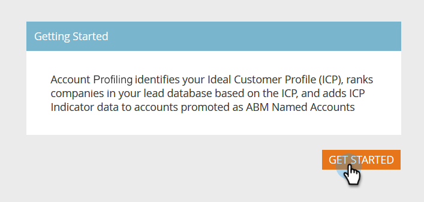

# Setting up Account Profiling {#setting-up-account-profiling}

Follow these steps to start using Account Profiling.

1. In My Marketo, open **Target Account Management**.

   

1. Click the **Account Profiling** tab.

   

1. The Model tab is opened by default. Click **Get Started**.

   

1. Give your model a name, choose who will be included in the results, and who will serve as the basis for the Ideal Customer Profile (ICP). Click **Create Model** when done.

   

1. Your model will begin its build. It may take a while, but don't worry, you'll be notified when it's done.

   

1. To see the results of your model, click **See Model Result**.

   

   Your model is now created.

   

   >[!TIP]
   >
   >Now that your model is created, [learn how to tune it](/help/marketo/product-docs/target-account-management/account-profiling/account-profiling-ranking-and-tuning.md).
