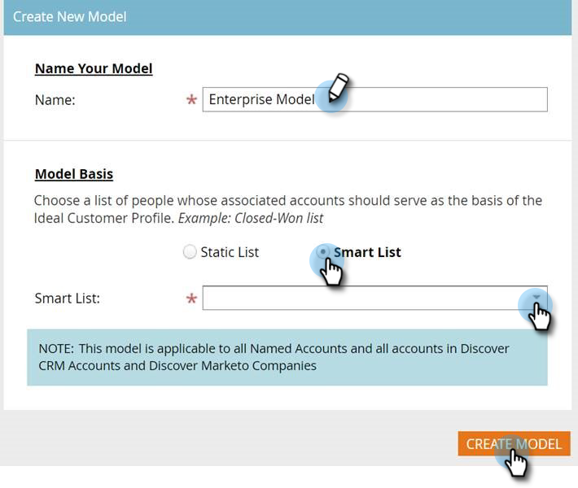

# Setting up Account Profiling {#setting-up-account-profiling}

Follow these steps to start using Account Profiling.

>[!CAUTION]
>
>The following fields must **not** be hidden in order for Account Profiling to function properly.
>
>* Website
>* Company
>* Email
>* Country
>
>Learn how to [unhide a field here](/help/marketo/product-docs/administration/field-management/hide-and-unhide-a-field.md#unhide-a-field).

1. In My Marketo, open **[!UICONTROL Target Account Management]**.

   

1. Click the **[!UICONTROL Account Profiling]** tab.

   

1. The Model tab is opened by default. Click **[!UICONTROL Get Started]**.

   

1. Give your model a name and choose the list type/list of people who will serve as the basis for the Ideal Customer Profile (ICP). Click **[!UICONTROL Create Model]** when done.

   

1. Your model will begin its build. It may take a while, but don't worry, you'll be notified when it's done.

   

1. To see the results of your model, click **[!UICONTROL See Model Result]**.

   

   Your model is now created.

   

   >[!TIP]
   >
   >Now that your model is created, [learn how to tune it](/help/marketo/product-docs/target-account-management/account-profiling/account-profiling-ranking-and-tuning.md).
