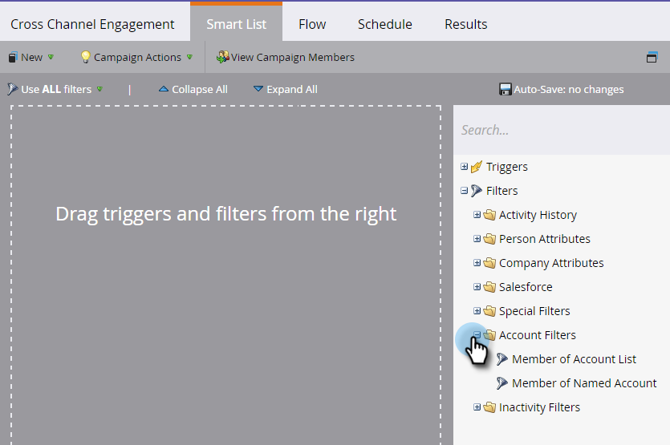
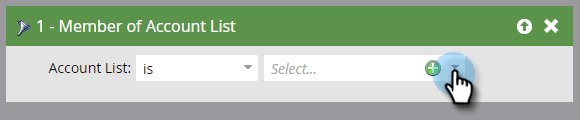

# Account Filters {#account-filters}

Identify and engage Named Accounts and the personas within them using new account-centric filters.

## TAM Filters {#tam-filters}

1. Select your smart campaign and click **Smart List**.

   

1. Click the **+** to expand the **Account Filters** folder.

   

1. Drag the filter(s) you want to use onto the canvas.

   

## Member of Account List {#member-of-account-list}

To use this filter, click the account list drop-down...

...and choose your desired account list(s).

>[!NOTE]
>
>For the Member of Account List filter, there's only one qualifier: "is" - Additional qualifiers (such as "is not" and "is any") are not available.

## Member of Named Account {#member-of-named-account}

First, choose a qualifier. **Is** for a specific named account(s) or **is any** for any named account.

   

Click the named account drop-down...

   

...and choose your desired named account(s).

   

If you use the "is any" qualifier, you may want to utilize [constraints](/help/marketo/product-docs/core-marketo-concepts/smart-lists-and-static-lists/using-smart-lists/add-a-constraint-to-a-smart-list-filter.md) to narrow your search results. Add as many as you'd like!

   

Set "Include Children" to false if you only want members from the single, top-level account. Select true if you want members from all child accounts.

   

>[!MORELIKETHIS]
>
>[Account Triggers](/help/marketo/product-docs/target-account-management/engage/account-triggers.md)
