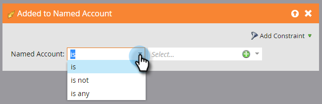

# Account Triggers {#account-triggers}

Listen and act on important account-level behavioral activities across different channels (e.g., email, web, ads) using account-level triggers.

Select your smart campaign and click **[!UICONTROL Smart List]**.

Enter "[!UICONTROL Named Account]" into the search box to find both [!UICONTROL Named Account] triggers.

Drag the trigger you want onto the canvas. In this example we're using _[!UICONTROL Added to Named Account]_.

Choose a qualifier.

Click the named account drop-down...

...and choose your desired named account(s).

After you finish the rest of your smart campaign, be sure to activate it.

>[!MORELIKETHIS]
>
>[Account Filters](/help/marketo/product-docs/target-account-management/engage/account-filters.md)
