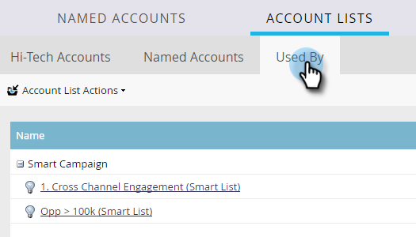

# Account List Insights {#account-list-insights}

The Account List dashboard offers a view of aggregated insights from all of the named accounts within that list.

>[!NOTE]
>
>Marketo ABM automatically determines the top named accounts within an account list based on pipeline generated or account engagement scores.

## Account List Dashboard {#account-list-dashboard}

To see an Account List's dashboard, simply click on its name...

...and the dashboard appears.

<table> 
 <tbody> 
  <tr> 
   <td colspan="1"><strong>Pipeline</strong></td> 
   <td colspan="1">See the pipeline over time. To determine pipeline over time by week, we take the pipeline on the last day.</td> 
  </tr> 
  <tr> 
   <td><strong>Revenue</strong></td> 
   <td>
See revenue over time. To determine revenue over time by week, we take the sum of all the revenue won in that week.
</td> 
  </tr> 
 </tbody> 
</table>

## Named Accounts Tab {#named-accounts-tab}

Click the **Named Accounts** tab to see which named accounts belong to that Account list.

>[!NOTE]
>
>You can remove a named account in this tab by selecting it and clicking **Remove Named Accounts**.

## Used By Tab {#used-by-tab}

Click the **Used By** tab to see which assets are referencing that Account List.

