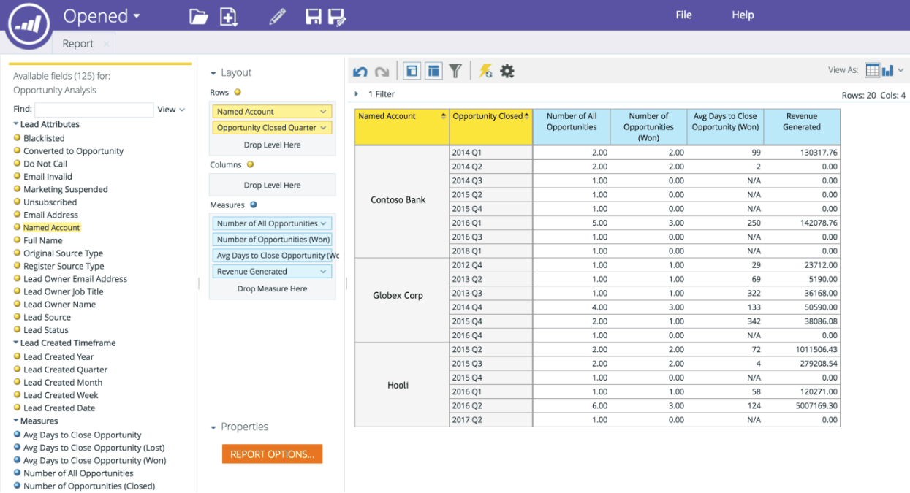
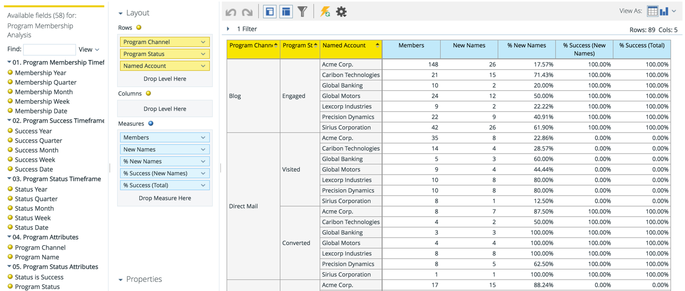

# Named Account Dimension in RCA {#named-account-dimension-in-rca}

Build revenue-based reports using the TAM-specific Named Account dimension in Revenue Cycle Analytics.

>[!NOTE]
>
>**Dimensions** - attributes (represented by yellow dots) that give different views of the measures.

>[!NOTE]
>
>The Named Account dimension in RCA can be used to measure bottom-line impact from targeted accounts (e.g. revenue won, pipeline generated or acceleration in sales cycle). This dimension can also be used to identify which programs did and did not perform well against named accounts.

The following reports have access to the Named Account dimension:

* Email Analysis
* Lead Analysis
* Opportunity Analysis
* Program Membership Analysis

>[!NOTE]
>
>Below are are some examples of Marketo TAM in Revenue Cycle Analytics.

Pipeline acceleration within named accounts

Channel effectiveness and success by named accounts

Program effectiveness and impact on bottom line

Coverage of quality leads and engagement within named accounts

