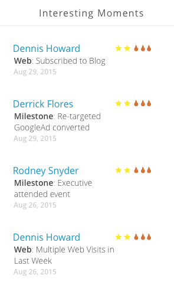
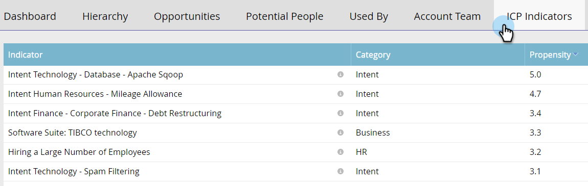

# Named Account Insights {#named-account-insights}

The Named Account Dashboard provides a 360-degree view of a target account.

## Dashboard {#dashboard}

The dashboard aggregates key insights at an account level from all the people within a named account, thus avoiding the need of going to each person to evaluate their progress. You can drill down deeper into email activity using [Email Insights](/help/marketo/product-docs/reporting/email-insights/filtering-in-email-insights.md#account-based-marketing).

>[!NOTE]
>
>Charts show insights from the last 90 days.

**Account Engagement Over Time** Click the **View** drop-down on the right to change what you view by. In addition to Account Score, you can view by Total Revenue...

...or Pipeline.

<table> 
 <tbody> 
  <tr> 
   <td><strong>Account Score</strong></td> 
   <td>
See week-to-week engagement based on all the account scores you created in Admin. You can compare these account scores side-by-side. To determine weekly engagement, we take the max engagement from any day of the week.
</td> 
  </tr> 
  <tr> 
   <td><strong>Pipeline</strong></td> 
   <td>See the pipeline over time. To determine pipeline over time by week, we take the pipeline on the last day.</td> 
  </tr> 
  <tr> 
   <td><strong>Revenue</strong></td> 
   <td>See revenue over time. To determine revenue over time by week, we take the sum of all the revenue won in that week.</td> 
  </tr> 
 </tbody> 
</table>

**Interesting Moments**

Available to users of Marketo Sales Insight, see the interesting moments rolled-up at an account level.

**Top People**

These people are calculated based on priorities that are based on recency or urgency showed by people of named accounts (same as [Best Bets](/help/marketo/product-docs/marketo-sales-insight/msi-for-salesforce/features/stars-and-flames/priority-urgency-relative-score-and-best-bets.md) in Sales Insight), or Scores defined by the user. **Priority** is only available to users of Marketo Sales Insight.

**Includes Children**

Click **Includes Children** to see and choose the child accounts of the selected named account and view their aggregate analytics.

>[!NOTE]
>
>When selecting accounts, you can either choose select all, or individually select up to 100.

## Hierarchy {#hierarchy}

See where the selected named account lives in relation to its hierarchy.

## Opportunities {#opportunities}

A roll-up view of all the open opportunities at an account level, helping Marketing teams focus on closing specific opportunities.

## Potential People {#potential-people}

Lead-to-Account matching uses fuzzy logic to find weak matches that can be resolved in the Potential People tab.

>[!NOTE]
>
>To add any of the listed people, select them and click **Add People**.

## Used By {#used-by}

This tab shows which smart campaigns, web campaigns, smart lists or reports currently reference specific named accounts or account lists.

## Account Team {#account-team}

View account team members, add/remove members, even assign an account owner in this tab.

>[!NOTE]
>
>Click the **Account Team Actions** drop-down to add/remove account members, or assign an account owner.

## ICP Indicators {#icp-indicators}

View the ICP Indicators you selected to export when you [tuned your model](/help/marketo/product-docs/target-account-management/account-profiling/account-profiling-ranking-and-tuning.md#model-tuning).

