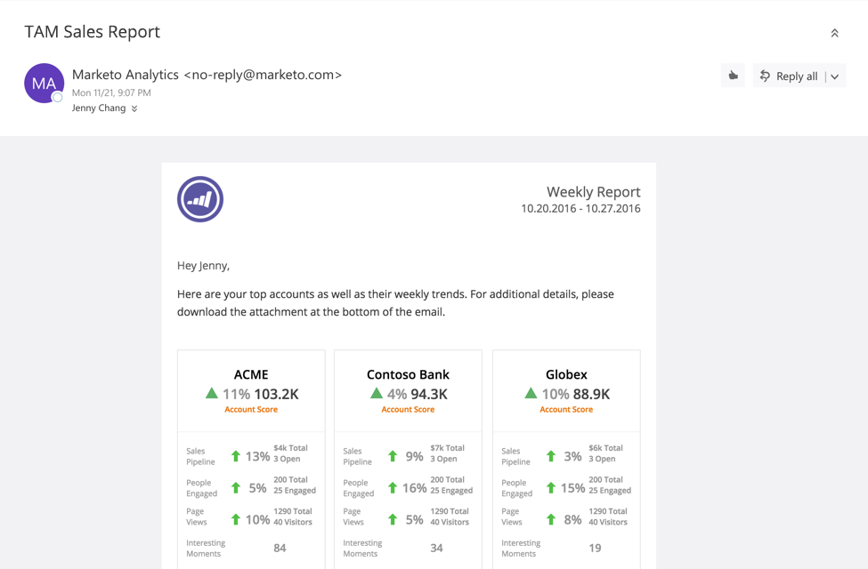

# TAM Sales Report {#tam-sales-report}

Receive a weekly email containing your top accounts and their weekly trends.

>[!NOTE]
>
>Learn how to set up this report [here](/help/marketo/product-docs/target-account-management/measure/tam-report-setup.md).

The report shares:

* Named accounts sorted by the account score you choose
* Top engaged people
* Key trends and interesting moments
* A link to download a CSV file containing additional details

## Sales Report Key {#sales-report-key}

<table> 
 <tbody> 
  <tr> 
   <td><strong>Account Score</strong></td> 
   <td> 
    

      Weekly trend by account score (selected in setup), followed by current account score 
    
</td> 
  </tr> 
  <tr> 
   <td><strong>Sales Pipeline</strong></td> 
   <td> 
    

      Weekly trend by pipeline, followed by total current pipeline and number of open opportunities 
    
</td> 
  </tr> 
  <tr> 
   <td><strong>Page Views</strong></td> 
   <td> 
    

      Weekly trend of page views, followed by total page views and number of unique visitors 
    
</td> 
  </tr> 
  <tr> 
   <td><strong>Interesting Moments</strong></td> 
   <td> 
    

      Total number of interesting moments that occurred during the week 
    
</td> 
  </tr> 
 </tbody> 
</table>
