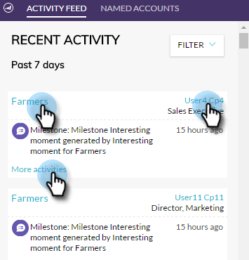

# Account Insight Plug-in Overview {#account-insight-plug-in-overview}

Account Insight is a Chrome plug-in that surfaces actionable TAM and account insights to your sales teams, allowing them to engage accounts more effectively.

>[!AVAILABILITY]
>
>* Account Insight is included for all customers who have both TAM and Marketo Sales Insight. For customers who only have TAM, Account Insight is available as a purchased add-on. Each customer is limited to 250 Account Insight seats. Please contact your sales rep for details. It is not available to customers who do not have TAM.
>
>* This plug-in is not compatible with [Adobe Identity authentication](/help/marketo/product-docs/administration/marketo-with-adobe-identity/adobe-identity-management-overview.md){target="_blank"} at this time.

>[!CAUTION]
>
>The Account Insight plug-in will not work in subscriptions that have [SSO-only](/help/marketo/product-docs/administration/additional-integrations/restrict-user-login-to-sso-only.md) (single sign-on) enabled.

>[!CAUTION]
>
>CRM context works for Salesforce when launching the plug-in from an Account, Lead or Contact. CRM context will not work for Dynamics when launching the plug-in from an Account, Lead or Contact. For Dynamics users, we recommend using the Account Insight plug-in.

## Named Accounts {#named-accounts}

See named accounts in order of their rank among each other. This list is available to account owners only. Account team support is coming soon.

To see details for a named account, click its name...

...and the overview appears.

See interesting moments by using the drop-down.

Scroll down to see best bets. Interesting moments is here too, along with engaged people.

Click a person's name...

...and see their activity.

You can also switch the view from Engagement to Pipeline.

To exit out of the named account, click the X on the upper-right.

## Activity Feed {#activity-feed}

The activity feed shows recent activity, going back seven days.

Click the **Filter** drop-down to filter by different activity types.

Several items are clickable. Click the named account to see its details. Click the name of the user to see their activity. Click More Activities to see, well, more activities.

Pretty cool stuff!

>[!MORELIKETHIS]
>
>[Set up Account Insight](/help/marketo/product-docs/target-account-management/setup-tam/set-up-account-insight.md)
