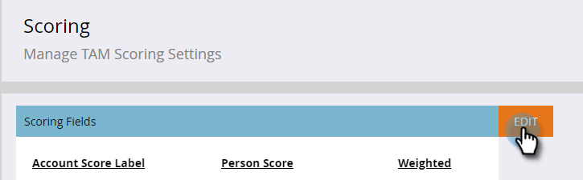
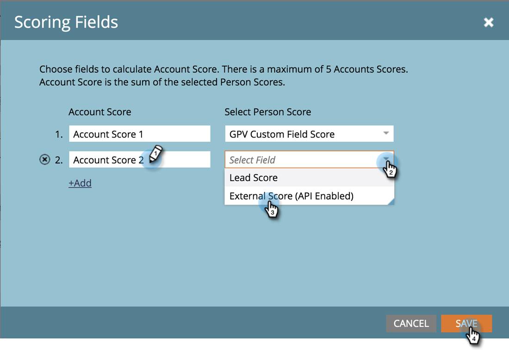

# [!UICONTROL Account Score] {#account-score}

Account Scoring is a vital part of [!UICONTROL Target Account Management]. It helps you determine the level of engagement of your accounts.

## What is Account Scoring? {#what-is-account-scoring}

It's a systematic approach designed to help Sales and Marketing teams identify and prioritize the companies (including prospects) that are most likely to make a purchase.

In the complex world of B2B buying processes, it’s rare that a single individual makes a purchase decision. There are often various roles involved, each with their own needs. Account-based scoring takes this into account by aggregating the lead scores from multiple leads and providing a score at an account level.

## Common Examples {#common-examples}

<table> 
 <tbody>
  <tr>
   <td><strong>Account Engagement Score</strong></td> 
   <td>Depth of engagement based on behavioral activities tracked across various channels (e.g. email, web, ad) from people in specific target accounts.</td>
  </tr>
  <tr>
   <td><strong>Account Product Interest Score</strong></td>
   <td>People from target accounts showing interest in the content from a specific product (e.g. downloading a white paper).</td> 
  </tr>
  <tr>
   <td><strong>Account Web Engagement Score</strong></td>
   <td>People from target accounts visiting web channel. Same score can be created to measure channel engagement from email, ad, or other channels.</td> 
  </tr>
 </tbody>
</table>

## How to Configure Account Score {#how-to-configure-account-score}

>[!NOTE]
>
>To calculate account scores, you first need to create lead scores. Marketo TAM automatically aggregates lead scores to account scores. As an example, we'll take two of the above examples (_Account Product Interest Score_ and _Account Web Engagement Score_).
>
>First, create lead score fields that capture relevant details from each lead of a target account.  
>Then assign those lead scores to their respective account scores:  
>Account Product Interest Score = SUM (Lead Product Interest Score)  
>Account Web Engagement Score = SUM (Lead Web Engagement Score)

>[!NOTE]
>
>Users can create multiple account engagement scores and assign different person scores to different account scores.

Once you've configured the lead score, proceed by following the steps below.

1. Click **[!UICONTROL Admin]**.

   

1. Click **[!UICONTROL Target Account Management]**.

   

1. In [!UICONTROL Scoring Fields], click **[!UICONTROL Edit]**.

   

   >[!NOTE]
   >
   >You can choose up to **five** fields to calculate the [!UICONTROL Account Score].

1. Enter the [!UICONTROL Account Score] name, click the **[!UICONTROL Select Person Score]** drop-down and select the corresponding score.

   

1. Click **[!UICONTROL +Add]** to add more scores.

   

1. Add all desired scores. Click **[!UICONTROL Save]** when done.

   
