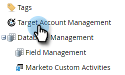

# Account Team Setup {#account-team-setup}

An account team is a group of stakeholders who work together on a named account. Follow these steps to choose which CRM account roles should be added.

1. Click **Admin**.

   

1. Click **Target Account Management**.

   

1. Under Account Team Members, click **Edit**.

   

   >[!NOTE]
   >
   >For Account Role, give it a name and match it to the desired User Lookup Field in your CRM.

1. Type in your Account Role name and select the **CRM** field. Add up to 10.

   

   >[!NOTE]
   >
   >You are not able to select Account Owner. It's chosen by default from the account level in your CRM.

1. Click **Save** when done.

   

   >[!CAUTION]
   >
   >If you make an update, it may take some time for the changes to reflect in TAM.

   >[!NOTE]
   >
   >* When Multiple CRM Accounts with different account owners are merged into a Named Account, Marketo will pick one "Account Owner" and add other account owners as "Account Co-Owners"
   >
   >* If a CRM "Role" field is later renamed or deleted, Marketo TAM will stop syncing the updated values until the user manually updates the setup in TAM
