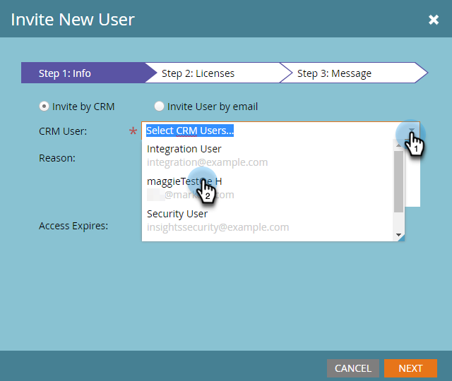

# Invite Users to Access Account Insight {#invite-users-to-access-account-insight}

Follow these steps to provide users access to Account Insight.

1. Click **Admin**.

   

1. Click **Users & Roles** in the tree. Then click the **Sales Users** tab, and **Invite New Sales User**.

   

   There are two ways to invite users: By CRM or by email. In this example we'll use Invite by CRM.

   >[!NOTE]
   >
   >When inviting new (non-Marketo) users via the CRM user list, you can invite multiple people at a time. Invite by email is 1 for 1.

1. Click the **CRM User** drop-down and select the desired user.

   

   >[!NOTE]
   >
   >If you choose **Invite User by email**, simply enter their first name, last name, and email address, and continue to step 4.

1. To set an expiration date for the user's access (optional), click the calendar icon. It's set to "never" by default.

   

1. Click **Next**.

   

1. Check the **Account Insight** checkbox and click **Next**.

   

1. Look over the send message, make any desired changes (optional) and click **Send**.

   
