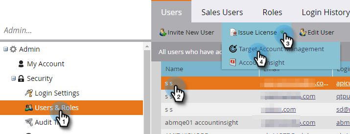
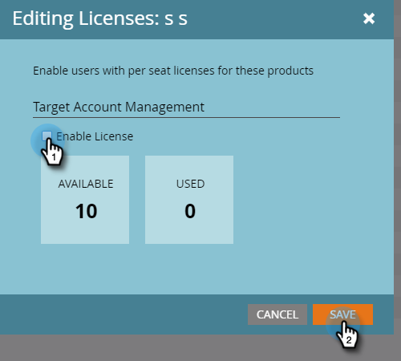

# Issue a License {#issue-a-license}

You'll need to set users up with a license to use TAM. Here's how to do that.

>[!NOTE]
>
>The number of available licenses will vary based on your subscription. If you need more, please contact your sales rep.

1. Click **Admin**.

   

1. Click **Users & Roles**. Select the user to issue the license to, click the **Issue License** drop-down, and select **Target Account Management**.

   

1. Check the **Enable License** checkbox and click **Save**.

   

   >[!NOTE]
   >
   >To remove a user's license, follow step 1, then uncheck the checkbox and click **Save**.
