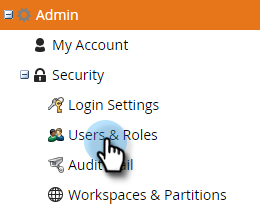
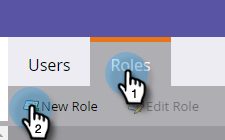
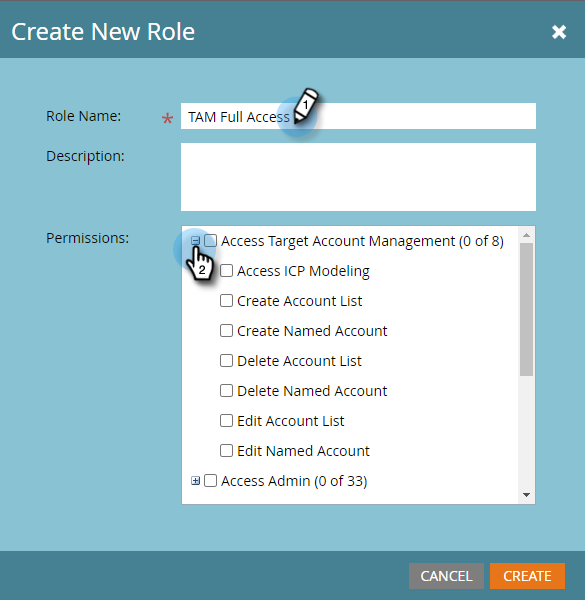
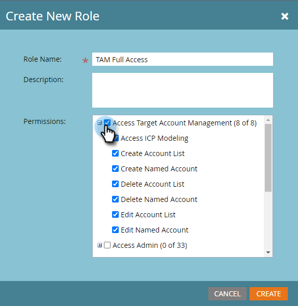
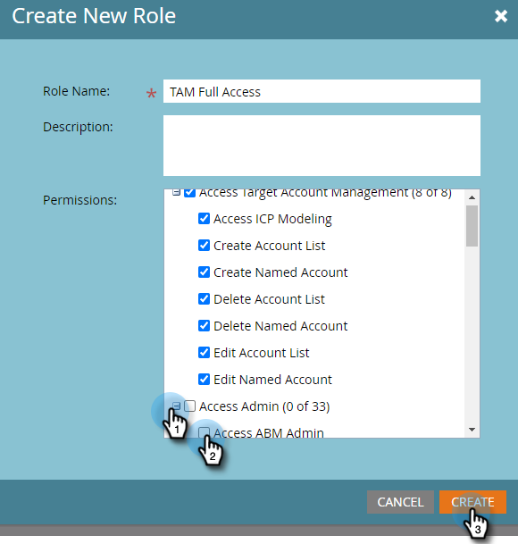

# Permissions {#permissions}

You'll need to set-up permissions for your users to be able to use TAM. Here's how.

1. Click **[!UICONTROL Admin]**.

   

1. Click **[!UICONTROL Users & Roles]**.

   

   >[!NOTE]
   >
   >You can add TAM permissions for an existing role, or create a brand new one. This example uses a new role.

1. Click **[!UICONTROL Roles]**, then **[!UICONTROL New Role]**.

   

1. Enter a Role Name and click the **+** icon next to the **[!UICONTROL Access Target Account Management]** checkbox.

   

1. To select _all_ permissions, simply check the **[!UICONTROL Access Target Account Management]** checkbox.

   

   >[!NOTE]
   >
   >You also have the option to select only some of the options. Do that by checking each checkbox individually.

1. Click the **+** to open the **[!UICONTROL Access Admin]** menu. Check the **[!UICONTROL Access ABM Admin]** checkbox (ABM is the previous name for TAM) and click **[!UICONTROL Create]**.

   

   Your new TAM role is now ready to be [assigned to a user](/help/marketo/product-docs/administration/users-and-roles/managing-user-roles-and-permissions.md#assign-roles-to-a-user)!
