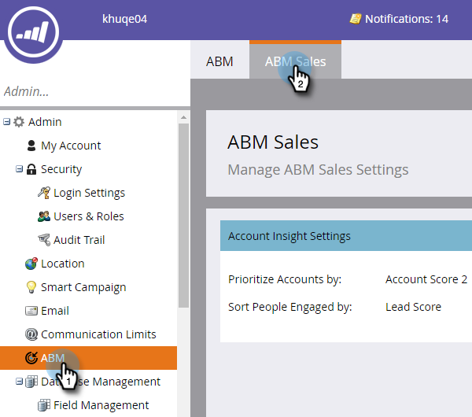

# Set up Account Insight {#set-up-account-insight}

Here's how to set up Account Insight.

>[!PREREQUISITES]
>
>ABM account score [must be configured](/help/marketo/product-docs/target-account-management/setup-tam/account-score.md) first.

1. Click **Admin**.

   

1. Click **ABM** in the tree, then the **ABM Sales** tab.

   

1. Click **Edit**.

   

1. Click the drop-downs to choose how Account Insight prioritizes named accounts and engaged people.

   

   >[!NOTE]
   >
   >If the [Account Score settings](/help/marketo/product-docs/target-account-management/setup-tam/account-score.md) are updated at any point, the configuration under ABM Sales needs to be updated by an Admin to make sure the scores accurately reflect the user's preferences. The user needs to log out and log back in to see the changes.

1. Click **Save**.

   
