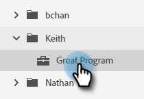
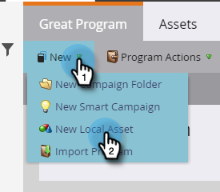
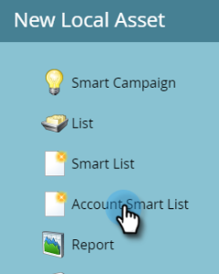
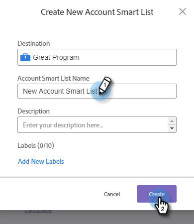
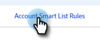
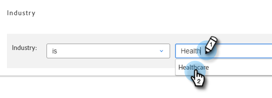
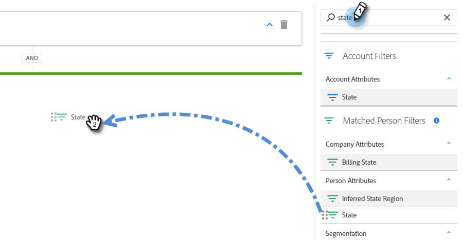
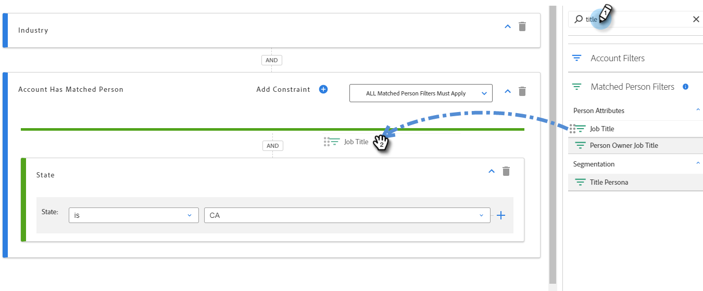
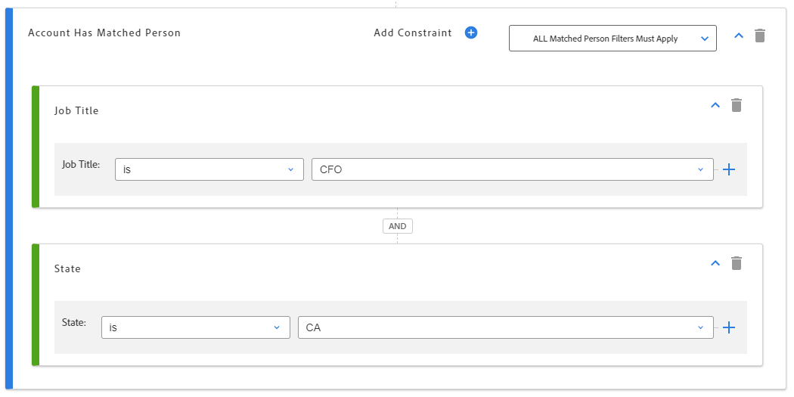
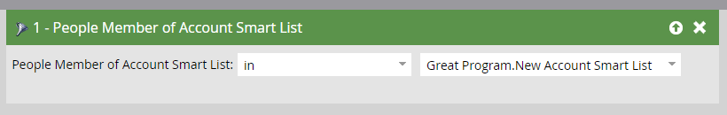

# Account Smart Lists {#account-smart-lists}

Here's how to quickly and accurately identify your high value accounts.

>[!NOTE]
>
>This feature is only available to those with both the [!UICONTROL Target Account Management] add-on and a TAM licensed issued.

## Create an [!UICONTROL Account Smart List] {#create-an-account-smart-list}

1. In Marketo, go to **[!UICONTROL Marketing Activities]**.

   

1. Find and select your desired program.

   

1. Click the **[!UICONTROL New]** drop-down and select **[!UICONTROL New Local Asset]**.

   

1. Click **[!UICONTROL Account Smart List]**.

   

1. Enter a name and click **[!UICONTROL Create]** (Description and Labels are optional).

   

Your [!UICONTROL Account Smart List] has been created! See below for steps on defining its rules.

## [!UICONTROL Account Smart List] Rules {#account-smart-list-rules}

[!UICONTROL Account Smart Lists] work similarly to standard Smart Lists, with a notable exception: containers.

1. To define your [!UICONTROL Account Smart List], click the **[!UICONTROL Account Smart List Rules]** tab.

   

1. Choose your desired Account Filter(s). In this example we're choosing _[!UICONTROL Industry] is [!UICONTROL Healthcare]_.

   

   

1. Choose your Matched Person Filter(s). In this example we're choosing _[!UICONTROL State] is [!UICONTROL California]_.

   

**Optional Step**: Here's where containers come in. If you choose an additional Matched Person Filter, you can drop it below the first one, or _in_ it, creating a container. In this example we're creating a container by adding _[!UICONTROL Job Title] is [!UICONTROL CFO]_.

   

Here's how the container will look.

   

>[!NOTE]
>
>Creating a container of filters creates an "and" rule, meaning it will only return all of the results combined. In this example, accounts with an industry of healthcare, along with being located in California _and_ with someone listed as the CFO. If you don't want to utilize containers simply drop the filter below/above the existing one.

And that's it! Check out the section below to see how you can leverage your [!UICONTROL Account Smart List].

>[!TIP]
>
>Just like with standard Smart Lists, you can use advanced logic to further refine your results. You need at least three filters to do so, and in [!UICONTROL Account Smart Lists], one container (regardless of how many filters it itself contains) equals one filter.

## [!UICONTROL Account Smart List] Actions {#account-smart-list-actions}

In the Overview tab of your [!UICONTROL Account Smart List], you'll notice a few action options.

**[!UICONTROL Export]**: This exports the results of your [!UICONTROL Account Smart List] as a CSV.

**[!UICONTROL Clone]**: Makes a copy of your [!UICONTROL Account Smart List].

**[!UICONTROL Send to Ad Network]**: Sends the list to [!DNL LinkedIn] as a new Matched Audience.

You can also reference your [!UICONTROL Account Smart List] in a standard Smart Campaign/List by using the _[!UICONTROL People Member of Account Smart List]_ filter.

   

>[!NOTE]
>
>The results of the [!UICONTROL People Member of Account Smart List] will show every person in the identified account(s), not just people who are found via Matched Person filters in the account smart list.

>[!NOTE]
>
>**Definition**
>
>**[!UICONTROL People Member of Account Smart List]**: In this case the word "member" refers to the account itself, so "people member" means the actual people (Marketo records) in those accounts.
