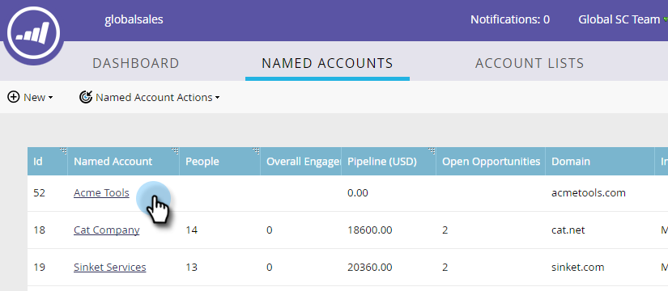

# Add an Existing [!UICONTROL Named Account] to an Account List {#add-an-existing-named-account-to-an-account-list}

Adding a named account to an account list is simple.

>[!NOTE]
>
>This applies only to Account Lists, **not** Dynamic Account Lists.

1. Select the row of the named account you want to add to.

   

1. Click the **[!UICONTROL Named Account Actions]** drop-down and select **[!UICONTROL Add to Account List]**.

   

1. Click the **[!UICONTROL Account List]** drop-down, select the desired account list, and click **[!UICONTROL Add]**.

   

   That's it!

>[!MORELIKETHIS]
>
>[Create a [!UICONTROL Named Account]](/help/marketo/product-docs/target-account-management/target/named-accounts/create-a-named-account.md)
