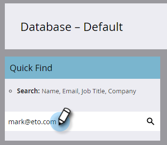

# Add People to a Named Account {#add-people-to-a-named-account}

There are three different ways to manually add people to a named account in TAM.

## Single Flow Action {#single-flow-action}

1. Click **Database**.

   

1. Enter the person's email address and press enter.

   

1. Click the person to select it. Click the **Person Actions** drop-down, click **Marketing** and select **Add to Named Account**.

   

1. Click the **Named Account** drop-down, select the desired Named Account, and click **Run Now**.

   

## Smart Campaign Flow Step {#smart-campaign-flow-step}

1. Select your Smart Campaign and click **Flow**.

   

1. In the search box enter "Add to Named Account."

   

1. Drag the filter onto the canvas.

   

1. Click the **Named Account** drop-down and select the desired Named Account.

   

   That's it! Next just schedule (or activate) your smart campaign, and the flow step will start adding qualifying people to the designated named account.

## List Import {#list-import}

1. Select your list, click the **List Actions** drop-down and select **Import List**.

   

1. After you choose your file and settings, click **Next**.

   

1. Map your desired fields. Make sure the **Named Account** field is mapped.

   

1. Choose your desired settings, then click **Import**.

   

>[!MORELIKETHIS]
>
>[Lead to Account Matching](/help/marketo/product-docs/target-account-management/target/named-accounts/lead-to-account-matching.md)
