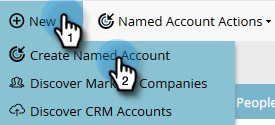
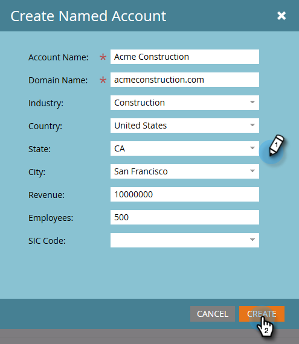

# Create a [!UICONTROL Named Account] {#create-a-named-account}

Follow these steps to manually create a named account.

1. In [!UICONTROL Named Accounts], click the **[!UICONTROL New]** drop-down and select **[!UICONTROL Create Named Account]**.

   

1. Fill out desired fields and click **[!UICONTROL Create]**.

   

   >[!TIP]
   >
   >Click directly on a named account to see its dashboard.

>[!MORELIKETHIS]
>
>[Add People to a [!UICONTROL Named Account]](/help/marketo/product-docs/target-account-management/target/named-accounts/add-people-to-a-named-account.md)
