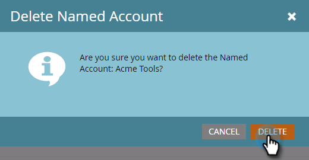

# Delete a [!UICONTROL Named Account] {#delete-a-named-account}

Follow these quick steps to delete a named account.

1. Select the row of the named account(s) you want to delete.

   

   >[!NOTE]
   >
   >Ctrl+click (Windows) or Cmd+click (Mac) to select multiple named accounts.

1. Click the **[!UICONTROL Named Account Actions]** drop-down and select **[!UICONTROL Delete Named Account]**.

   

1. Click **[!UICONTROL Delete]**.

   

   >[!NOTE]
   >
   >Accounts which have synced to your CRM cannot be deleted in TAM. If the delete option is not available, or if you receive a "These accounts can't be deleted because one or more CRM accounts is selected" message, they must be deleted directly in the CRM.
