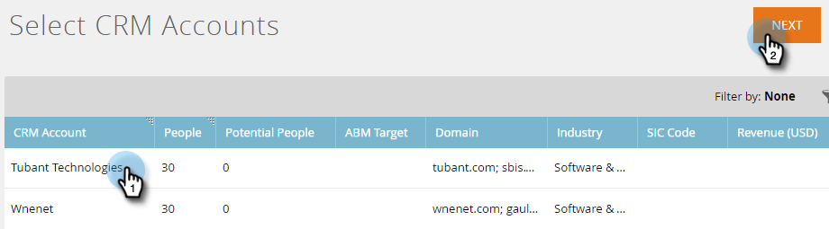
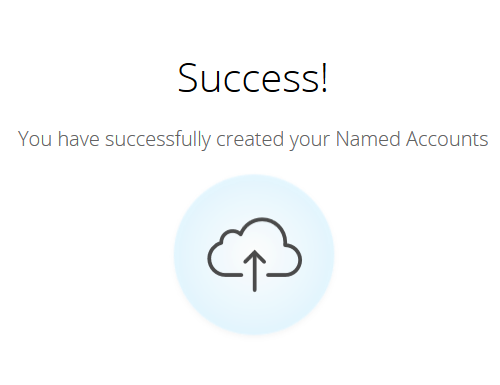
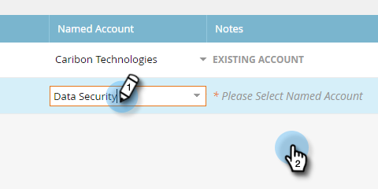
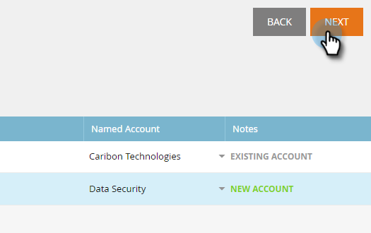

# Discover Accounts {#discover-accounts}

Use the Discover option to identify potential target accounts.

## [!UICONTROL Discover CRM Accounts] {#discover-crm-accounts}

Identify potential target accounts from your CRM.

>[!NOTE]
>
>After you connect your CRM to Marketo TAM, **[!UICONTROL Discover CRM Accounts]** will show all the CRM accounts and relevant information to help you choose the right named accounts. Marketo adds additional information on top of what's received from the CRM.

**[!UICONTROL People]** (In [!UICONTROL Discover CRM Accounts] & [!UICONTROL Discover Marketo Companies]): Includes both Contacts and Leads. Leads can be discovered using Marketo's [lead-to-account matching](/help/marketo/product-docs/target-account-management/target/named-accounts/lead-to-account-matching.md).

**[!UICONTROL Potential People]** (In [!UICONTROL Discover CRM Accounts] & [!UICONTROL Discover Marketo Companies]): Shows how many leads Marketo found that could possibly belong to a CRM account.

**Custom CRM field** (In [!UICONTROL Discover CRM Accounts] only): This will help you align your sales and marketing organization for selection of correct target accounts. Once you [map the custom CRM field](/help/marketo/product-docs/target-account-management/setup-tam/create-a-custom-field-for-crm-discovery.md) with Marketo TAM, we’ll show you the mapped data to help you identify your target accounts.

1. In [!UICONTROL Named Accounts], click the **[!UICONTROL New]** drop-down and select **[!UICONTROL Discover CRM Accounts]**.

   

1. A new window/tab will open. Select the CRM account(s) you want to add to your [!UICONTROL Named Accounts] and click **[!UICONTROL Next]**.

   

1. The preview screen confirms your amount of selections. Click **[!UICONTROL Create]**.

   

   That's all there is to it!

   

## [!UICONTROL Discover Marketo Companies] {#discover-marketo-companies}

Identify the right companies for targeting.

>[!NOTE]
>
>In [!UICONTROL Discover Marketo Companies], you will see Marketo companies that didn't come from your CRM.

1. In [!UICONTROL Named Accounts], click the **[!UICONTROL New]** drop-down and select **[!UICONTROL Discover Marketo Companies]**.

   

1. A new window/tab will open. Select the companies you want to add to your [!UICONTROL Named Accounts] and click **[!UICONTROL Next]**.

   

   >[!NOTE]
   >
   >In [!UICONTROL Discover Marketo Companies] and Discover CRM, Marketo automatically:
   >
   >* Finds people from your Marketo database that have that company listed in their record. If you see multiple values for some of the attributes (e.g., Industry), it's because Marketo found different values listed for those individual people. The attribute with the most hits wins
   >
   >In **Discover CRM** only, Marketo automatically:
   >
   >* Syncs and associates CRM Contacts with the [!UICONTROL Named Account]
   >
   >In **[!UICONTROL Discover Marketo Companies]** only, Marketo automatically:
   >
   >* Filters out most Internet Service Providers and Public Domains (e.g., yahoo.com, gmail.com) as company names
   >
   >* Dedupes CRM accounts. If you have "Acme" in one record and "Acme Inc" (or any of the following suffixes: Co, Corp, Corporation, Gmbh, Inc, Incorporated, LLC, LLP, LP, Ltd, PA, PC, PLC, PLLC), we will merge them in TAM as just "Acme"
   >
   >If you'd like Marketo to de-dupe accounts by CRM ID or [!UICONTROL Account Owner] instead of by Company Name, please contact [Marketo Support](https://nation.marketo.com/t5/Support/ct-p/Support).

1. Click the down arrow under the [!UICONTROL Named Account] column to reveal the drop-down.

   

   >[!CAUTION]
   >
   >Going forward, any new people from these selected companies will automatically be assigned to their respective named accounts. Please double-check these companies and make sure they are assigned to the correct [!UICONTROL Named Account].

1. To select an existing Account, click the **[!UICONTROL Named Account]** drop-down, choose the desired account, then click **[!UICONTROL Next]**.

   

   You also have the option of creating a new [!UICONTROL Named Account] by typing the desired name directly in the drop-down box. Click away from the box when done...

   

   ...and you'll see your new [!UICONTROL Named Account]. At that point just click **[!UICONTROL Next]** like in Step 4.

   

1. Click **[!UICONTROL Create]**.

   

   Nice work!

   

>[!NOTE]
>
>If you're seeing a mismatch between CRM accounts you've selected and what's in the Discover CRM Grid, it's likely due to one or more of the following:
>
>* Having different CRM accounts with similar names that got de-duped
>* The next scheduled sync hasn't occurred yet

>[!MORELIKETHIS]
>
>[Lead to Account Matching](/help/marketo/product-docs/target-account-management/target/named-accounts/lead-to-account-matching.md)
