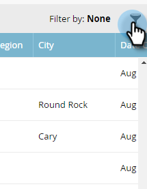
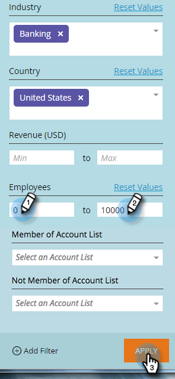

# Filtering in [!UICONTROL Named Accounts] {#filtering-in-named-accounts}

Filtering is a great way to narrow down data quickly.

>[!NOTE]
>
>Data in filter drop-downs reflects all available fields in your CRM that have been synced to Marketo.

1. Click on the filter icon.

   

   >[!NOTE]
   >
   >There are a several search parameter combinations. In this example we locate: _[!UICONTROL Industry] = Banking, [!UICONTROL Country] = United States, Max [!UICONTROL Employees] = 10000_.

1. Click the **[!UICONTROL Industry]** drop-down and select **[!UICONTROL Banking]**.

   

1. Click the **[!UICONTROL Country]** drop-down and select **[!UICONTROL United States]**.

   

1. Under **[!UICONTROL Employees]**, type "0" in the **Min** field, "10000" in the **Max** field, then click **[!UICONTROL Apply]**.

   

   And that's it! Your filtered results appear on the left side of the screen.

   >[!NOTE]
   >
   >To add more filters to choose from, click **[!UICONTROL Add Filter]** at the bottom left of the form.
