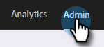
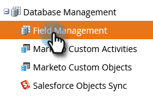
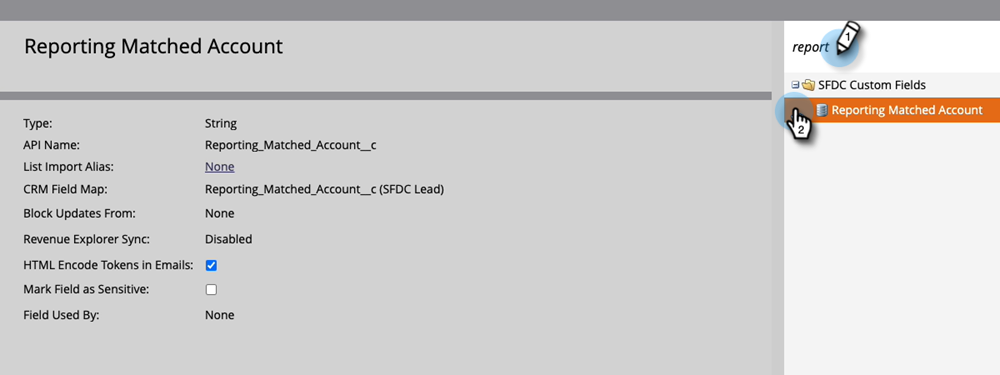

# Lead to Account Matching {#lead-to-account-matching}

Match right leads to right named accounts using Marketo Lead-to-Account matching.

>[!NOTE]
>
>**Lead-to-Account Matching** is a built-in feature of Marketo [!UICONTROL Target Account Management]. It uses fuzzy logic to automatically match leads to the right named accounts in near real-time. These named accounts could be CRM accounts or Marketo companies.

## Overview {#overview}

Marketo Lead-to-Account Matching follows a 4 step process:

**Step 1 -** Our matching process begins by using key information on the lead records, such as:

* Email Domain (e.g., acme.com)
* Inferred company name from IP address
* Company name - This could be CRM account name or lead company name attribute (e.g., came from form fill out)

**Step 2 -** We normalize the company names that we find based on various lead attributes (e.g., Acme Inc. and Acme Corp are automatically normalized to Acme). This step ensures we have a single representation of the named account in Marketo, and can see all the leads within a single named account.

**Step 3 -** We partition matched leads into 2 buckets: Strong Match and Weak Match.

* Weak-matched leads appear on the named accounts which then can be resolved manually.

**Step 4 -** We present a list of proposed companies with strong and weak matches. When a named account is created based upon one of the proposed companies, we create matching rules to automatically associate new leads (e.g., lead filled out a form) going forward to the right named accounts. This way you can worry less about matching leads and more about obtaining revenue!

Since Marketo Lead-to-Account matching is a built-in feature of Marketo [!UICONTROL Target Account Management], matching leads to accounts happens in near real-time (e.g., the moment a lead fills out a Marketo form, we associate said lead with the right named account). This event can be used to trigger alerts and notify account owners of the new leads that are coming in from their named accounts.

>[!NOTE]
>
>If you use LeanData in Salesforce to do Lead-to-Account matching, Marketo has an integration that will sync those matches to your Marketo instance. To have that feature enabled, please contact [Marketo Support](https://nation.marketo.com/t5/Support/ct-p/Support) Learn how to set up LeanData below.

## Using LeanData for Lead to Account Matching {#using-leandata-for-lead-to-account-matching}

After [Marketo Support](https://nation.marketo.com/t5/Support/ct-p/Support) has enabled LeanData for your account, follow the steps below to set it up.

1. In Salesforce, click **[!UICONTROL Setup Home]** in the left nav.

1. Still in the left nav, under Administration, click **[!UICONTROL Users]** then **[!UICONTROL Profiles]**.

1. Locate and select the **Marketo Sync** profile.

1. Scroll down to the Field Level Security section and locate the Lead object. Select **[!UICONTROL View]**.

1. For the field name "Reporting Matched Account," make sure the checkbox in the **[!UICONTROL Read Access]** column is selected.

1. In Marketo, go to the **[!UICONTROL Admin]** section.

   

1. Select **[!UICONTROL Field Management]**.

   

1. Confirm the field is there by searching “[!UICONTROL Reporting Matched Account].”

   

>[!MORELIKETHIS]
>
>[Discover Accounts](/help/marketo/product-docs/target-account-management/target/named-accounts/discover-accounts.md)
