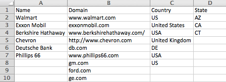
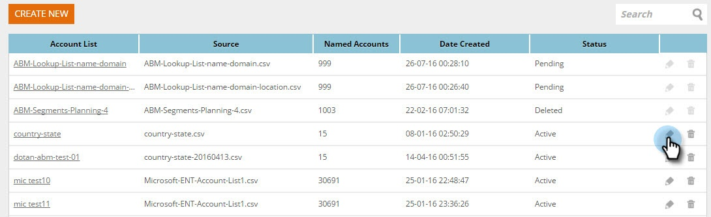
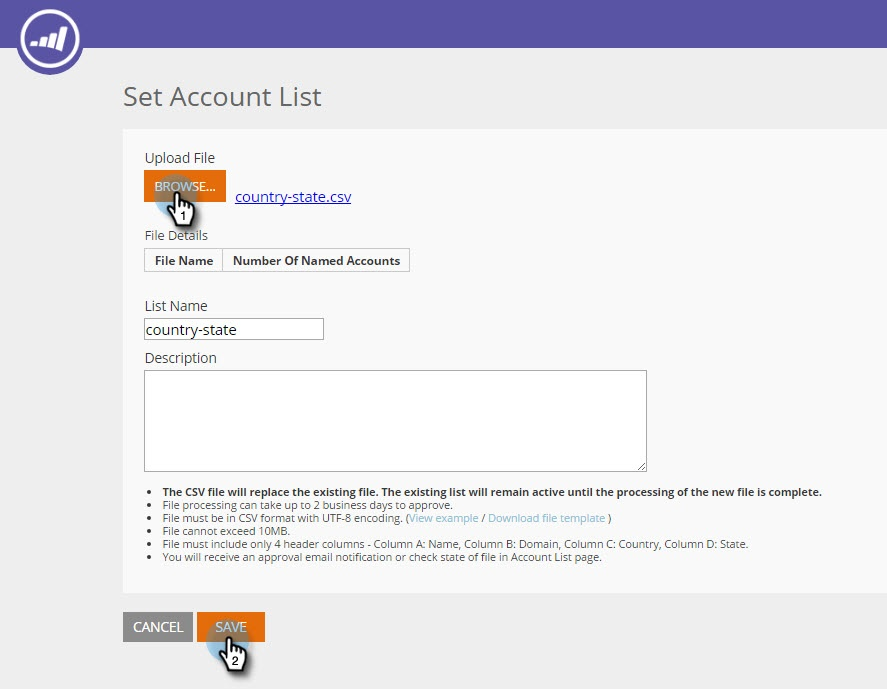
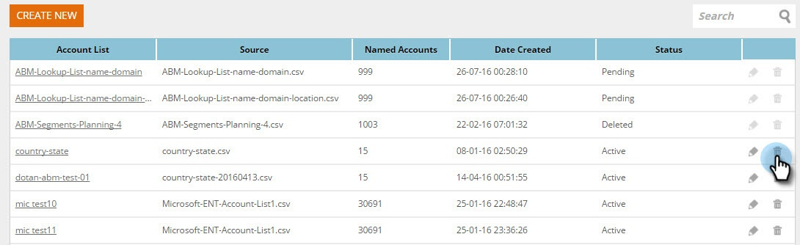

# Create a New Account List {#create-a-new-account-list}

Create and upload a list of organization and domain names to target these key accounts with personalized campaigns.

>[!NOTE]
>
>This article applies legacy Web ABM customers only. If you acquired Web ABM after September of 2016, please follow the steps in [this article](https://docs.marketo.com/display/DOCS/Account+Lists#AccountLists-CreateaNewAccountList) instead.

## Create a New Account List {#create-a-new-account-list-1}

1. Go to **Account Lists**.

   

1. Select **Create New**.

   

1. Select **Browse** and upload your CSV file (Make sure the csv file meets the criteria). Add a **Name** and **Description**. Click **Save**.

   

   >[!NOTE]
   >
   >**What is the format for the CSV File?**
   >
   >Make sure the named account CSV file meets the following requirements:
   >
   >* Saved as a CSV format
   >* Does not exceed 10MB
   >* Only 4 columns with the header Column A: Name, Column B: Domain, Column C: Country, Column D: US State.  
   >* File uploaded can take up to 2 business days before approval.
   >* You will receive an approval email notification or check state of file in Named Accounts page.
   >* The total number of records/rows accumulated for all your lists uploaded starts at 10K, with the largest package totalling 100K.

   >[!NOTE]
   >
   >**Example of the CSV file**
   >
   >* Row 1 Column A value = Organization
   >* Row 1 Column B value = Domain
   >* Row 1 Column C value = Country
   >* Row 1 Column D value = US State
   >* One of the column values is mandatory. However, providing both Organization and Domain names improves the match rates of the Account List.
   >* Country and State are optional values.
   >
   >   * For country name, use full country name or abbreviation code. Eg. United States or US.
   >   * For a U.S. State, use the 2-letter abbreviation code, i.e. CA. Only U.S. states are recognized.
   >
   >

## Edit an Account List {#edit-an-account-list}

On the **Account Lists** page, click the **Edit** icon on the list.

Select **Browse** and upload your new CSV file. This file will replace the original file. Click **Save**. The new uploaded file will be in a pending state until approved by Marketo Support, when in a pending state the original file will remain active.

The CSV file will replace the existing file. The existing list will remain active until the processing of the new file is complete.

## Delete a Named Account List {#delete-a-named-account-list}

1. On the **Account Lists** page, click the Delete icon of the list you wish to delete.

   

1. A message appears to confirm if you want to delete the list. Click **OK**.

   

>[!MORELIKETHIS]
>
>[Create a Segment Using an Account List](/help/marketo/product-docs/web-personalization/account-based-web-marketing/create-a-segment-using-an-account-list.md)
