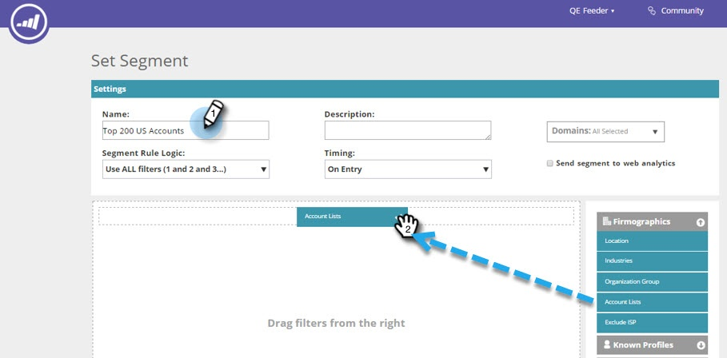
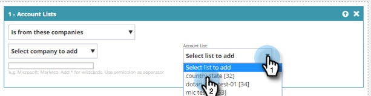
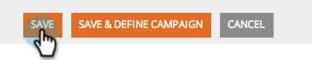

# Create a [!UICONTROL Segment] Using an [!UICONTROL Account List] {#create-a-segment-using-an-account-list}

Here's how to create a segment using an [!UICONTROL Account List].

>[!PREREQUISITES]
>
>[Create a New [!UICONTROL Account List]](/help/marketo/product-docs/target-account-management/target/account-lists.md)

1. Go to **[!UICONTROL Segments]**.

   

1. Click **[!UICONTROL Create New]**.

   

1. Enter a **[!UICONTROL Name]** for the [!UICONTROL segment]. Drag and drop **[!UICONTROL Account Lists]** from the **[!UICONTROL Firmographics]** section.

   

1. Select an **[!UICONTROL Account List]** from the list of named accounts you've uploaded. The number in brackets next to the [!UICONTROL Account List] Name is the ID of the List for API reference.

   

   >[!NOTE]
   >
   >[!UICONTROL Account Lists] are synced from ABM to Web Personalization for use in Segmentation. Select them from the drop-down. The sync can take up to five minutes. It will only sync if there are one or more Named Accounts in the [!UICONTROL  Account List].

1. Click **[!UICONTROL Save]**, or click **[!UICONTROL Save & Define Campaign]** to go to the Campaigns page.  

   

Congratulations! You've now set up a segment targeting an [!UICONTROL Account List].
