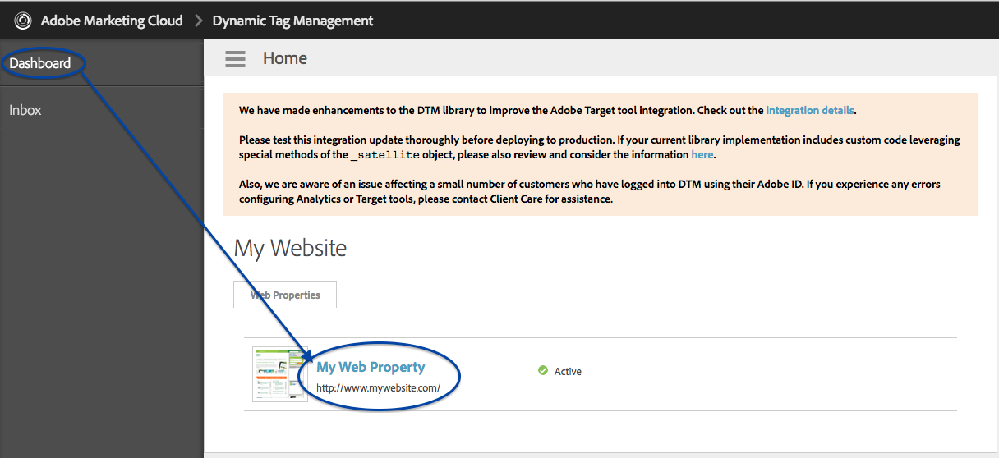
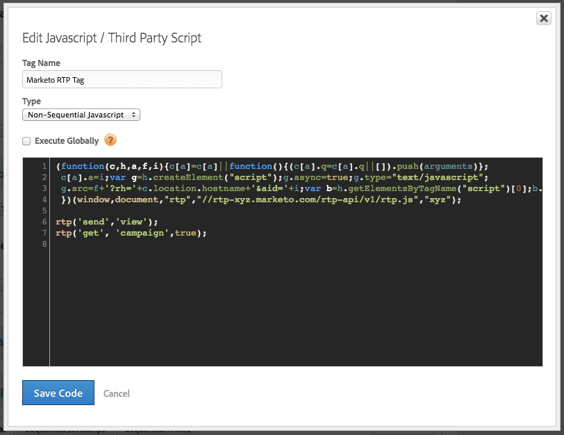

# Implementing RTP using Adobe Tag Manager {#implementing-rtp-using-adobe-tag-manager}

Implementing RTP using Adobe Tag Manager - Marketo Docs - Product Documentation

To implement your RTP tag please follow the installation instructions below:

1. Login to your RTP account**.**
1. Go to** Account Settings.**

    1. If you have already received your JavaScript tag from Support - continue to step 4.  
       

1. Under Domain, locate the relevant domain and click&nbsp;**Generate Tag**.  
   ** 

   **

1. Login to your Dynamic Tag Manager account ([https://dtm.adobe.com/sign_in](https://dtm.adobe.com/sign_in)).
1. Go to&nbsp;**Dashboard. **Click on** **the relevant web property.  
     

1. Go to&nbsp;**Rules,&nbsp;**click **Create New Rule.**

1. Fill out the following

    1. Name: **Marketo RTP**
    1. Conditions (collapse) : Trigger rule at &nbsp;-&nbsp;**Top of Page**
    1. Javascript (collapse): click **Add New Script**

   

1. Call the new tag: **Marketo RTP Tag**&nbsp;
1. Remove the following code from the RTP tag

    1. 

1. Paste the RTP JavaScript tag.

   

   >[!CAUTION]
   >
   >Make sure you remove all tags and leave only the script itself (no  )

1. Click **Save Code** in the script editor and **Save Rule **in the rule editor.

1. In the Rules panel, locate the Marketo RTP page load rule and within the **Actions **dropdown select&nbsp;**Activate Rules**.  
   

1. &nbsp;**Verify**&nbsp;that it appears on all pages including landing pages and sub-domains.

    1. You can do it by right-clicking on your website’s pages. Go to **Inspect Element**, click on **Network,&nbsp;**Search: **RTP**.

