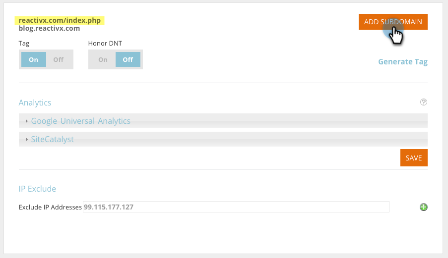
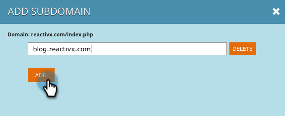
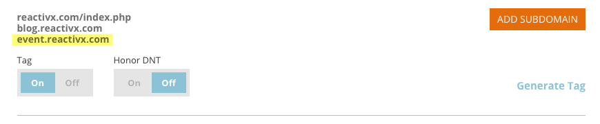

# Add Subdomains in Account Settings {#add-subdomains-in-account-settings}

Here's how to add subdomains to your primary domains in Account Settings. This will allow you to manage subdomains related to the specific RTP Javascript of your primary domain. It is recommended to deploy the Javascript tag to any added subdomains.

1. In Web Personalization, go to **Account Settings**.

   

1. On the Domain Configuration page, you'll see a list of all the primary domains associated with your account. Each section lists the primary domain first (highlighted below), followed by any subdomains. Click **Add Subdomain**.

   

1. Click **Add**.

   

1. Enter the subdomain URL. Click **Add** or **Delete** to manage your list of subdomains, then click **OK** when you're done.

   

1. Your newly added subdomain will now be listed.

   

   >[!NOTE]
   >
   >If you want to add *primary* domains to your account, please contact [Marketo Support](http://docs.marketo.com/cdn-cgi/l/email-protection#10636560607f6264507d71627b75647f3e737f7d).

