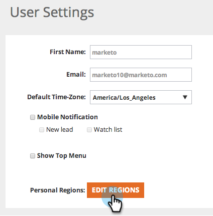

# Edit Regions {#edit-regions}

Edit Regions - Marketo Docs - Product Documentation

Looking to change your user regional settings to only see data for your specific region?

1. Go to **User Settings**.

   

1. Click **Edit Regions**.

   

1. Check your countries or states related to your region.

>[!NOTE]
>
>Selecting the United States, will open up at the bottom of the page all the US States options to select.

