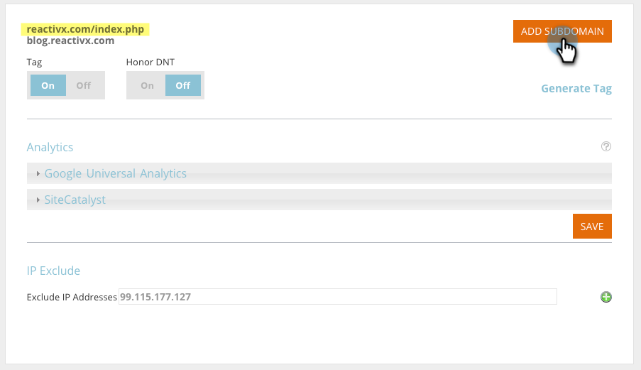
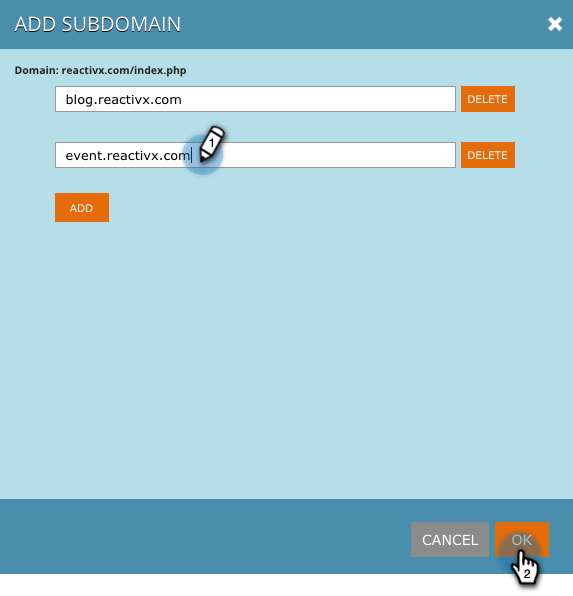

# Add Subdomains in [!UICONTROL Account Settings] {#add-subdomains-in-account-settings}

Here's how to add subdomains to your primary domains in [!UICONTROL Account Settings]. This will allow you to manage subdomains related to the specific RTP [!DNL Javascript] of your primary domain. It is recommended to deploy the [!DNL Javascript] tag to any added subdomains.

1. In Web Personalization, go to **[!UICONTROL Account Settings]**.

   

1. On the Domain Configuration page, you'll see a list of all the primary domains associated with your account. Each section lists the primary domain first (highlighted below), followed by any subdomains. Click **[!UICONTROL Add Subdomain]**.

   

1. Click **[!UICONTROL Add]**.

   

1. Enter the subdomain URL. Click **[!UICONTROL Add]** or **[!UICONTROL Delete]** to manage your list of subdomains, then click **[!UICONTROL OK]** when you're done.

   

1. Your newly added subdomain will now be listed.

   

   >[!NOTE]
   >
   >If you want to add _primary_ domains to your account, please contact [Marketo Support](https://nation.marketo.com/t5/Support/ct-p/Support).
