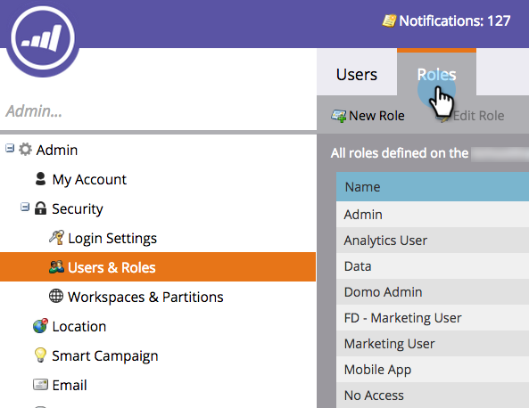
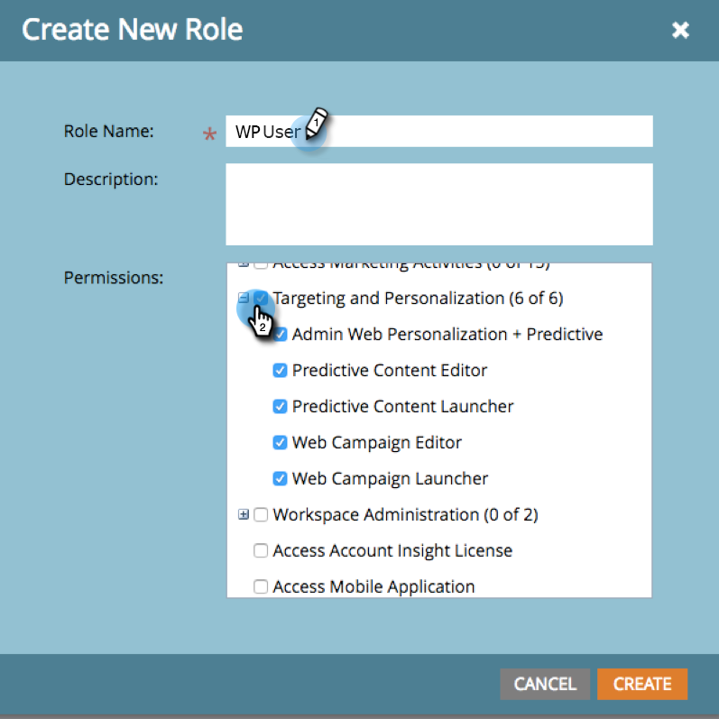
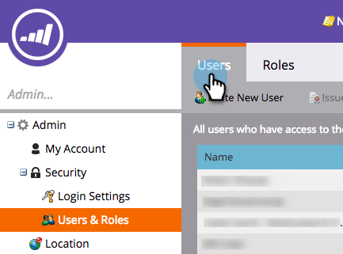
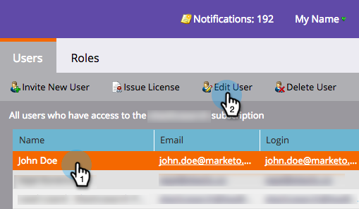
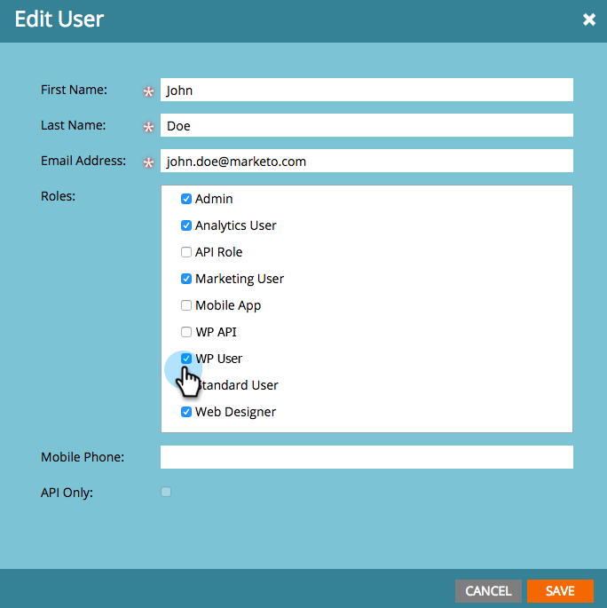

# Login and User Management {#login-and-user-management}

## Create a Web Personalization User Role {#create-a-web-personalization-user-role}

1. Go to the **[!UICONTROL Admin]** section, then click **[!UICONTROL Users & Roles]**.

   

1. Click **[!UICONTROL Roles]**.

   

   >[!NOTE]
   >
   >If the Web Personalization (WP) user role already exists, make sure it's configured as shown in Step 4.

1. Click **[!UICONTROL New Role]**.

   

1. Enter a [!UICONTROL Role Name] and select Permissions. Click **[!UICONTROL Create]** (this role must [apply to all workspaces](/help/marketo/product-docs/administration/users-and-roles/managing-marketo-users.md)).

   

   >[!TIP]
   >
   >To give users permission to access everything in Targeting and Personalization, be sure to select _all_ the checkboxes.

## [!UICONTRO Web Personalization] and Predictive Content User Permissions {#web-personalization-and-predictive-content-user-permissions}

**[!UICONTROL Targeting and Personalization]**: User has view only permissions, if this permission is only selected.

**[!UICONTROL Admin Web Personalization + Predictive]**: User has access to only the Account Settings and Content Setting for the Web Personalization and Predictive Content app. Users can view pages in the app but have no create, edit, delete, launch permissions.

**[!UICONTROL Predictive Content Editor]**: User has editor access to the Predictive Content app. The permission allows to create, edit, delete content pieces. It does not allow to enable content for Predictive use on web or email.

**[!UICONTROL Predictive Content Launcher]**: User has access to all Predictive Content features, except Account and Content Settings. The permission allows to create, edit and delete and enable content pieces.

**[!UICONTROL Web Campaign Editor]**: User has editor access to all Web Personalization feature to create, edit and delete but not launch Web campaigns.

**[!UICONTROL Web Campaign Launcher]**: User has access to all Web Personalization app features, except Account and Content Settings. The permission allows to create, edit, delete and launch Web campaigns.

## Assign WP Role to User {#assign-wp-role-to-user}

1. Go to **[!UICONTROL Users]**.

   

1. Select the user to grant WP access to and click **[!UICONTROL Edit User]**.

   

1. Select the WP user role for all workspaces.

   

1. Newly enabled users will see the **[!UICONTROL Web Personalization]** tile in My Marketo the next time they log-in.

   
