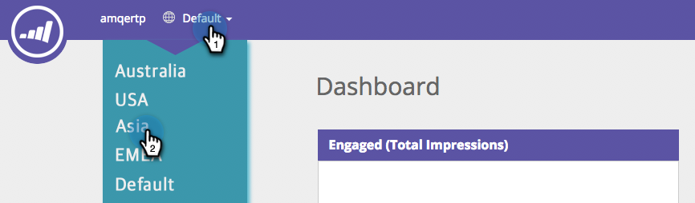
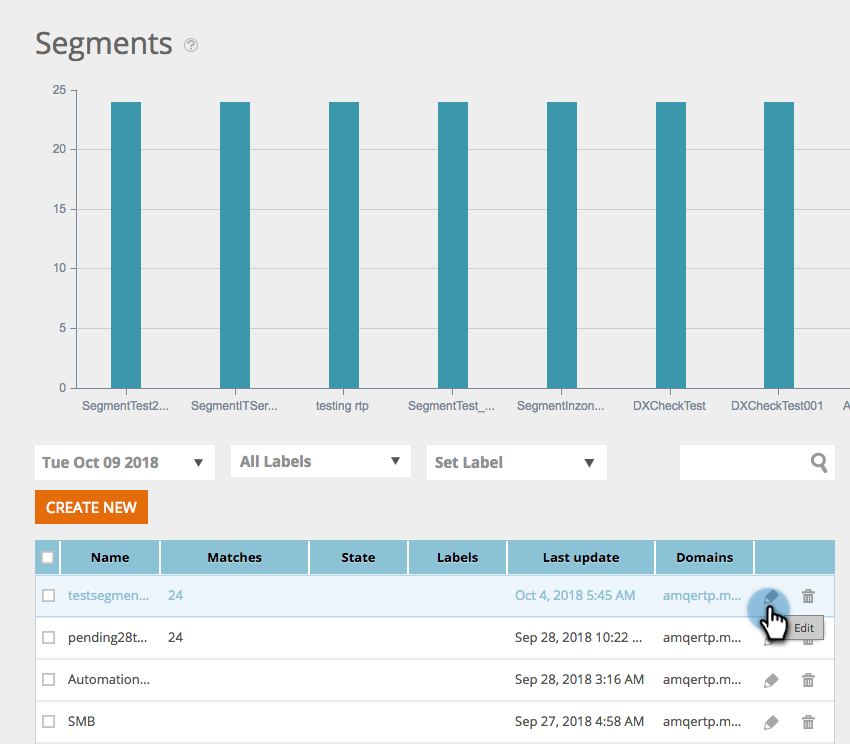
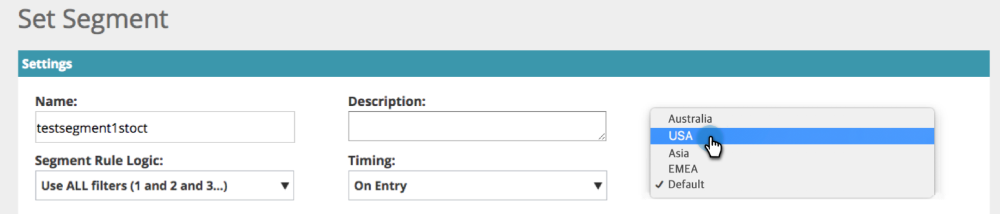

# Workspaces in [!UICONTROL Web Personalization] {#workspaces-in-web-personalization}

[!UICONTROL Web Personalization] supports multiple workspaces for web campaigns and web segments.

## Switch Workspaces {#switch-workspaces}

To switch between workspaces in web personalization, click the globe icon in the top left and choose a different workspace from the drop-down.

## Change a Segment's Workspace {#change-a-segments-workspace}

1. Go to the **[!UICONTROL Segments]** page, select a segment, and click the edit icon.

   

1. Select a different workspace from the **[!UICONTROL Workspace]** drop-down.

   

   

>[!NOTE]
>
>Users will only be able to see web campaigns and segments associated with the workspaces that they have access to. Here's how to [give a user access to one or more workspaces](/help/marketo/product-docs/administration/workspaces-and-person-partitions/allow-user-access-to-a-workspace.md).
