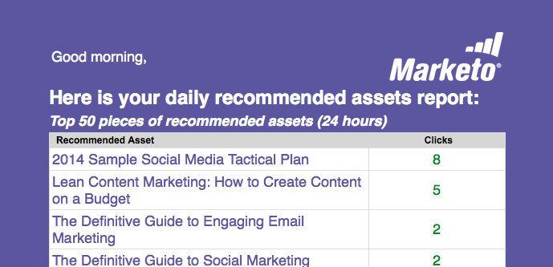

# Email Reports {#email-reports}

To customize which automated email report the user receives, see the&nbsp; [User Settings section](../../../product-docs/web-personalization/getting-started-rtp/user-settings.md).

### What's in this article? {#whats-in-this-article}

[Web Personalization Email Reports](#web-personalization-email-reports)  
[Daily/Weekly Organizations Report](#daily-weekly-organizations-report)  
[Daily/Weekly People Report](#daily-weekly-people-report)  
[Top Performing Real-time Campaigns](#top-performing-real-time-campaigns)  
[Top Performing Assets Report](#top-performing-assets-report)  
[Recommended Assets Report](#recommended-assets-report)  
[Summary Report](#summary-report)

#### Web Personalization Email Reports {#web-personalization-email-reports}

Daily or Weekly email reports are sent to the user's email address providing the latest organization, person, campaign and assets performance data.

The following reports are available:

#### Daily/Weekly Organizations Report {#daily-weekly-organizations-report}

The daily/weekly report sends the user an email of the top 50 visiting organizations, including the Organization name, location, number of visits, page views and referral site or search term used.

#### Daily/Weekly People Report {#daily-weekly-people-report}

The daily/weekly People Report sends the user an email of the latest 100 people from the website according to: person's email address, organization name, location, state, date of person capture and segments that person belongs to.

#### Top Performing Real-time Campaigns {#top-performing-real-time-campaigns}

The Top Performing Real-time Campaigns Report sends the user an email of the top performing real-time campaigns, showing the campaign name, impressions, clicks, the segment the campaign reacted to and the conversion rate of the campaign.

#### Top Performing Assets Report {#top-performing-assets-report}

The Top Performing Assets Report sends the user an email of the top performing content assets, showing the asset name and percentage of matches compared to other assets.

#### Recommended Assets Report {#recommended-assets-report}

The Recommended Assets Report sends the user an email of all the content and number of clicks that came from content displaying in the Content Recommendation Engine.

#### Summary Report {#summary-report}

The Summary report sends the user an email (monthly or quarterly) of all campaigns and recommended content performance based on number of clicks and number of people (direct or assisted) that engaged with the personalized campaign or recommended content and then became a known person. The report compares the results to the previous month or quarter.

>[!NOTE]
>
>**Definition**
>
>**Direct Conversion**: A web visitor who clicks on a personalized campaign or recommended content asset and in the same visit session proceeds to fill out any form on the website with their email address.
>
>**Assisted Conversion**: A web visitor who fills out any form on the website and leaves their email address, while in a previous visit (within the last 6 months) clicked on a personalized campaign or recommended content asset.

>[!NOTE]
>
>Marketo Web Personalization captures the email address of the web visitor for any form completed on the website. This is viewed in the Web Personalization People page and is the person that is used in the Summary report.

To customize which automated email report the user receives, see the [User Settings section](../../../product-docs/web-personalization/getting-started-rtp/user-settings.md).
